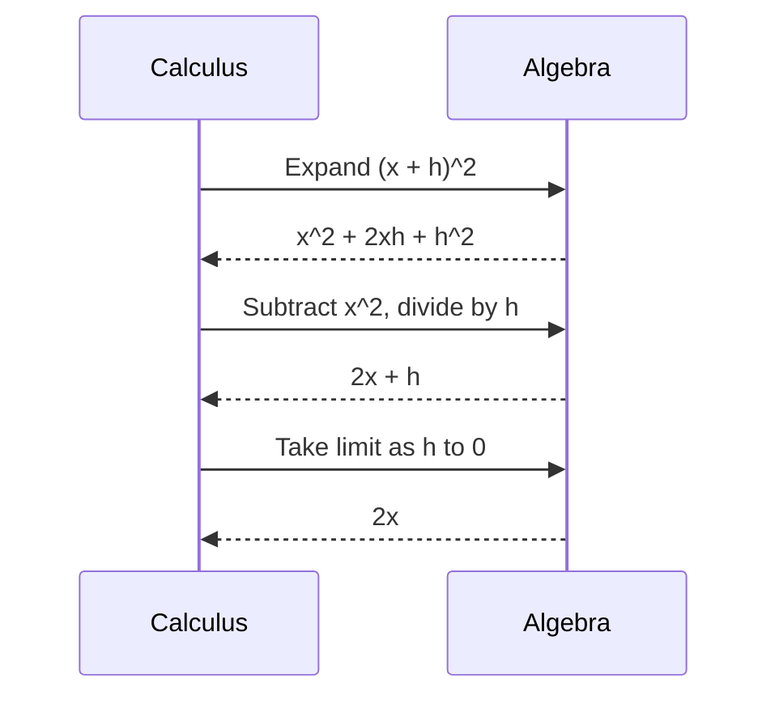

# mdlout cookbook

Task-oriented recipes. Each section: motivation, source skeleton,
rendered result, and the non-obvious "gotcha". For the full
frontmatter table and CLI flags see the top-level
[`README.md`](../README.md); for HTML-vs-PDF selection, citations,
figure numbering, and debugging see
[`docs/best_practices.md`](best_practices.md).

Each recipe points at a building example under
[`examples/`](../examples/) -- copy that file rather than this
snippet when you want a verified starting point.

## 1. Three-column poster

Conference posters want landscape A3, three even columns, and a
tall display title strip. mdlout has no `type: poster`; combine
`type: doc` + `orientation: Landscape` + `columns: 3` with a
raw-Lout title block.

```yaml
---
type: doc
title: Convergence of Newton-Cotes Quadrature on Singular Integrands
author: J. L. Clements
page: A3
orientation: Landscape
columns: 3
column-gap: 1.0c
top-margin: 2.5c
para-indent: 0f
para-gap: 1.4v
font: Helvetica Base 14p
page-headers: None
---

```lout
@CentredDisplay @Font { +24p } @B { Poster Title Here }
@CentredDisplay @Font { +12p } @I { Author -- Affiliation -- email }
@DP
```

## Abstract
...
```

Rendered: A3 landscape, three column-balanced flows, no page
header, a single tall title strip spanning all three columns.

**Gotcha:** the `@DP` after the title strip ends the spanning
display; without it the body inherits the centred-display style.
Working example:
[`examples/academic_poster.md`](../examples/academic_poster.md).

## 2. Math-heavy lecture notes

Notes are light on chrome and heavy on display math. KaTeX in HTML
mode handles the full LaTeX math menu; PDF mode falls back to a
placeholder. Pick HTML for the web, PDF only when archival
fidelity matters.

```yaml
---
type: doc
title: Lecture 04 - Newton-Cotes Quadrature
author: J. L. Clements
page: A4
font: Times Base 11p
para-gap: 1.0v
para-indent: 0f
---

# Definite integrals

A definite integral is the limit of a Riemann sum:

$$
\int_a^b f(x)\, dx = \lim_{n \to \infty} \sum_{i=1}^n f(x_i^*)\,\Delta x.
$$

The trapezoidal rule:

```math
T_n = \frac{h}{2}\left[f(a) + 2\sum_{i=1}^{n-1} f(x_i) + f(b)\right].
```
```

Rendered: A4 Times 11pt, `$$...$$` and ` ```math ` blocks centred,
inline `$...$` riding the line.

**Gotcha:** KaTeX renders `\\` only inside an environment
(`aligned`, `cases`, `pmatrix`, etc.). Bare `\\` at top level
silently does nothing. For PDF, swap `$$...$$` for raw Lout `@Eq`
(see recipe #7). Working example:
[`examples/04_math.md`](../examples/04_math.md).

## 3. Multi-chapter book

Long-form prose wants `type: book`: Roman chapter numbers, no
section numbers, running heads carrying the chapter title, generous
margins, indented paragraphs with zero gap.

```yaml
---
type: book
title: The Cartographers of Veil
author: James Clements III
font: Times Base 11p
page: A5
top-margin: 2.0c
foot-margin: 2.0c
left-margin: 2.0c
right-margin: 2.0c
para-gap: 0b
para-indent: 2f
chapter-start: Any
chapter-numbers: Roman
section-numbers: None
page-headers: Titles
---

# The Map That Drew Itself

Opening paragraph. `#` becomes `@Chapter` (Chapter I).

## A subsection within the chapter

`##` becomes `@Section`. With `section-numbers: None`, no prefix.
```

Rendered: A5 with running heads, Roman-numbered chapter openers,
body Times 11pt.

**Gotcha:** multiple chapters in one file work, but one chapter per
file is the conventional layout. mdlout has no drop-cap shorthand;
`@DropCapTwo` from `bsf` collides with chapter opening and must be
inserted in post. Working example:
[`examples/book_chapter.md`](../examples/book_chapter.md).

## 4. Slides with images

`type: slides` uses Lout's `slidesf`. Each `#` opens a new
`@Overhead`. The package has sharp edges in the current fork
(`@Verbatim` doesn't escape `@End`, symbol-table collisions with
`tab` and `diag`), so put code as prose and `@SVGFile` external
images.

```yaml
---
type: slides
title: An Introduction to Lout
author: James Clements III
---

# An Introduction to Lout

*A six-slide tour of the document formatting system*

# What is Lout?

- A high-level **document formatting language** in ANSI C
- Authored by Jeffrey H. Kingston (University of Sydney, 1991)

# A diagram (rendered externally)


# Thank you
```

Rendered: each `#` is a full slide; `` routes
through `@SVGFile` (inlined as `<image>` in HTML, rasterised via
`rsvg-convert` for PDF).

**Gotcha:** frontmatter beyond `type` / `title` / `author`
currently trips an `slidesf` + `@RefStyle` collision. KaTeX,
abcjsharp, and `@Diag` are off-limits on slides until that lands
-- pre-render and `` instead. Working example:
[`examples/slides_basic.md`](../examples/slides_basic.md).

## 5. Code-heavy manual

Manuals lean hard on syntax-highlighted code. mdlout autoloads
highlight.js (v11.9.0) for any fenced block with a language tag;
~190 languages work out of the box.

```yaml
---
type: report
title: My Project Technical Manual
author: Project Maintainers
cover: Yes
contents: Yes
page: A4
section-numbers: Arabic
para-indent: 0f
para-gap: 1.0v
font: Times Base 11p
---

[TOC]

# Installation

```bash
git clone https://example.com/project.git
cd project && make
```

# API surface

```python
def convert(text: str) -> str:
    return _convert_inner(text)
```
```

Rendered: A4 report with cover, multi-page TOC, prose interleaved
with syntax-highlighted listings.

**Gotcha:** highlight.js is **only loaded if at least one fenced
block has a language tag**. Untagged fences render in plain
monospace. Pass `--no-highlight` to suppress. Four fence languages
are intercepted by mdlout itself and never reach highlight.js:
` ```lout `, ` ```math `, ` ```abc `, ` ```svg `. Working example:
[`examples/technical_manual.md`](../examples/technical_manual.md)
(25 pages including a troubleshooting appendix).

## 6. Letterhead / single-page form

No `type: letter` exists. Use `type: doc` with symmetric margins,
no page header, zero indent, `1.2v` paragraph gap. Sender block,
date, recipient, and signature each ride in their own
` ```lout ` fence.

```yaml
---
type: doc
font: Times Base 11p
page: Letter
top-margin: 2.5c
foot-margin: 2.5c
left-margin: 2.5c
right-margin: 2.5c
para-gap: 1.2v
para-indent: 0f
page-headers: None
---

```lout
@RightDisplay {
James Clements III
//
1742 Larkspur Lane
//
james.l.clements.iii "@" gmail.com
}
```

```lout
@LeftDisplay { 21 May 2026 }
```

Dear Dr. Whitcombe,

Body of the letter as ordinary markdown paragraphs.
```

Rendered: US Letter, no header, sender block flush right, date
flush left, prose body.

**Gotcha:** `@` and `/` are Lout metacharacters -- quote them as
`"@"` and `"/"` to print literally. The `//` between address lines
is Lout's vertical-list separator, not a forward slash. Working
example: [`examples/letter.md`](../examples/letter.md).

## 7. Drop caps and pull quotes (raw Lout passthrough)

Markdown has no shorthand for either. Drop a ` ```lout ` fence
where you want the flourish. A pull quote is
`@CentredDisplay @I { ... }` with an attribution below. Drop caps
need `bsf` and currently fight with chapter openings -- insert
them in post.

```lout
@LP
@CentredDisplay @I {
"A map that lies is a nuisance. A map that prophesies is a calamity."
}
@CentredDisplay { --- Bertrand Velasquez, @I { Cartographic Ethics } (1974) }
@LP
```

Rendered: body paragraph, centred italic pull quote on its own
line, centred attribution beneath, body resumes.

**Gotcha:** the leading and trailing `@LP` are required -- without
them the quote glues to the surrounding paragraphs. Double-quoting
the string (`"A map..."`) keeps the apostrophes from being
reinterpreted by Lout. Pattern taken from
[`examples/book_chapter.md`](../examples/book_chapter.md).

For raw Lout `@Eq` math in PDF mode (the recipe-2 swap):

```lout
@CentredDisplay @Eq { int from 0 to inf e sup { - x sup 2 } d x = sqrt pi over 2 }
```

See
[`examples/07_raw_lout_and_svg.md`](../examples/07_raw_lout_and_svg.md).

## 8. Inline ABC music notation

` ```abc ` fenced blocks route through `@ABC` and are engraved by
**abcjsharp** in the browser (HTML mode only). The fork lives at
<https://github.com/clementsj/abcjsharp> and supports harp
grand-staff via `%%score (RH | LH)`.

```abc
X:1
T:Frere Jacques
M:4/4
L:1/4
K:G
G A B G | G A B G | B c d2 | B c d2 |
```

```abc
X:2
T:Twelve-Bar Blues in G
M:4/4
L:1/4
K:G
"G" G B d g | "G" g B d B | "C" c e g c' |
```

Rendered: each fence engraves as a score in the HTML. Chord
symbols sit above the staff; multiple voices and the fork's
grand-staff layout both work.

**Gotcha:** PDF mode treats `@ABC` as a stub -- the block renders
as `[ABC music notation: ...]` literal text. For PDF, pre-render
with `abcm2ps` or `abcjsharp` and `` it. ABC inside
`type: slides` is also broken (collides with `slidesf` flow).
Three blocks of increasing complexity, including the harp
grand-staff, in
[`examples/05_music.md`](../examples/05_music.md).

## 9. Custom mydefs macros (the sidecar file convention)

When a document needs a one-off Lout macro -- a project display
style, a custom font size, a hand-built `@SyntaxDiag` shortcut --
the convention is a sidecar file called `mydefs` next to the input
`.md`. mdlout auto-copies it into the build directory and Lout
picks it up via `@Include { mydefs }`.

`mydefs`:

```lout
def @ProjectTitle right name
{
  @CentredDisplay @Font { +18p } @B { name }
}
```

`mypage.md`:

```yaml
---
type: doc
title: A Custom-Styled Document
font: Times Base 11p
---

```lout
@ProjectTitle { Project Alpha }
```

Body paragraphs as ordinary markdown.
```

Rendered: `@ProjectTitle` emits the centred-display heading at
+18 pt; the macro is available everywhere in the body via raw
Lout.

**Gotcha:** the sidecar must literally be named `mydefs` (no
extension) and sit next to the `.md` file -- or pass
`--mydefs path/to/file`. `def`s **must** match Lout's
right-name / left-name parameter convention; syntax errors surface
as "lout syntax error in symbol ..." on stderr.

## 10. Tables with alignment markers

Pipe tables accept `:---`, `:---:`, `---:` on the separator row;
mdlout translates these into Lout `@Cell indent { right }` /
`indent { ctr }`. Header rows auto-bold.

```yaml
---
type: doc
page: A4
font: Times Base 11p
---

# Convergence data

| n     |   error |   ratio |
|:------|--------:|--------:|
| 4     | 8.3e-2  |     -   |
| 8     | 2.1e-2  |    3.95 |
| 16    | 5.2e-3  |    4.04 |
| 32    | 1.3e-3  |    4.00 |

Numeric data follows the textbook $O(h^4)$ Simpson rate.
```

Rendered: four-row pipe table, left column left-aligned (default),
numeric columns right-aligned, header row bold, surrounding rule
drawn by Lout.

**Gotcha:** mdlout pipe tables **do not** support spanned cells
(no rowspan/colspan in the markdown). For spanning, drop into a
raw ` ```lout ` fence with `@Tab` directly -- the `@StartHSpan` /
`@StartVSpan` markers are in chapter 8 of the Lout User's Guide.
A "table" with no separator row renders as plain paragraphs. See
[`examples/03_lists_and_tables.md`](../examples/03_lists_and_tables.md)
for pipe and grid tables side by side, and
[`examples/scientific_paper.md`](../examples/scientific_paper.md)
for the numeric-data worked example.

## 11. CV / resume layout

Resumes want dense, two-column typesetting on one page: small body
font, tight paragraph gap, no page header, and a centred banner heading
at the top. `type: doc` with `columns: 2` gives the right page geometry;
`@TaggedList` from `bsf` gives the label-and-content "Languages: ..."
look for skills.

```yaml
---
type: doc
title: Curriculum Vitae
font: Times Base 10p
page: Letter
top-margin: 1.8c
foot-margin: 1.8c
left-margin: 2.0c
right-margin: 2.0c
columns: 2
column-gap: 0.8c
para-gap: 0.6v
para-indent: 0f
page-headers: None
---

```lout
@CentredDisplay { +6p } @Font @B { Jane Doe }
@CentredDisplay { Portland, OR "  --  " jane "@" example.com }
@DP
```

## Experience

**Cantus Audio, Portland OR**  ---  *Lead engineer*, 2022 -- present.

- Owns the real-time DSP pipeline.
- Brought worst-case block latency from 11 ms to 2.8 ms.

## Skills

```lout
@LP
@TaggedList
@TagItem { @B { Languages } } { C, C++17, Python, Rust. }
@TagItem { @B { DSP } } { Convolution, FFT, FDN reverb. }
@EndList
```
```

Rendered: Letter-size single page, banner with name and contact info
spanning both columns at the top, dense two-column body flowing
section-by-section, no page header.

**Gotcha:** `type: doc` + `columns: 2` is a *single-page* layout --
Lout has no automatic continuation onto page 2 in this mode, so if the
content overflows the warning is `too little horizontal space for galley
@DocumentBody` and the bottom of your CV is silently dropped. Keep the
body tight, or trim a section. The `+6p` size adjuster goes *before*
`@Font` (`{ +6p } @Font @B { ... }`); putting it inside the body braces
(`@Font { +6p } @B { ... }`) silently prints "+6p" as literal text.
Working example:
[`examples/cv.md`](../examples/cv.md).

## 12. Conference handout

A handout is a single Letter or A4 page intended for printing on one
side: abstract at the top, two or three section headings below, often
with a QR code or URL at the foot. `type: doc` with a moderate font
size and tight margins is the right base; treat it as a one-page
report with no cover.

```yaml
---
type: doc
title: Real-Time Convolution Reverbs on ARM
author: Jane Doe -- Cantus Audio
font: Times Base 11p
page: Letter
top-margin: 2.0c
foot-margin: 2.0c
left-margin: 2.2c
right-margin: 2.2c
para-gap: 0.9v
para-indent: 0f
page-headers: None
---

```lout
@CentredDisplay { +4p } @Font @B {
  Real-Time Convolution Reverbs on ARM
}
@CentredDisplay { Jane Doe "  --  " Cantus Audio "  --  " ADC 2026 }
@DP
```

**Abstract.** This handout summarises the engineering trade-offs
behind a 96 kHz partitioned convolution reverb shipping on Cortex-A78,
including the lock-free scheduler that brings worst-case 64-sample
block latency below 3 ms.

## Method

Brief description of the FFT block scheduler ...

## Results

Latency numbers, CPU figures ...

## Where to find more

Slides: <https://cantus.example.com/adc2026>
```

Rendered: a single Letter page with banner, abstract paragraph, two
short sections, footer URL. No TOC, no cover, no page number.

**Gotcha:** keep the document *short enough to fit on one page*. As
with the CV (recipe #11), `type: doc` doesn't paginate gracefully when
the body overflows -- you'll get the `too little horizontal space`
warning and content will be dropped. If you need a longer printable
brief, switch to `type: report` with `cover: No` and `contents: No`,
and let Lout paginate normally. The H1 / H2 mapping under `type: doc`
is `@Display`, not `@Section`, so headings *won't* number themselves.

## 13. Exam / quiz paper

Exam papers are numbered questions with blank answer space between
them, plus an answer-key section at the end. Markdown numbered lists
don't reset across raw-Lout fences, so each question is written as
its own H2 (`## Question 1.  ...`); the blank workspace below each
question is a `//Nc` vertical-list separator inside an `@LP`-wrapped
raw-Lout fence.

```yaml
---
type: doc
font: Times Base 11p
page: Letter
top-margin: 2.2c
foot-margin: 2.2c
left-margin: 2.5c
right-margin: 2.5c
para-gap: 0.9v
para-indent: 0f
page-headers: None
---

```lout
@CentredDisplay @B { Calculus I "--" Midterm }
@LP
```

**Name:** _(write here)_  **Student ID:** _(write here)_

## Question 1.  Limits  (15 points)

Evaluate the limit of (x^2 - 4)/(x - 2) as x approaches 2.

```lout
@LP
//3.5c
@LP
```

## Question 2.  Differentiation  (20 points)

Compute the derivative of f(x) = x^3 sin(x).

```lout
@LP
//4.0c
@LP
```

# Answer Key

**Q1.** Factor: (x - 2)(x + 2)/(x - 2) = x + 2, evaluated at 2 gives 4.
```

Rendered: title banner, name/ID line, each question heading followed
by prose and a fixed-height blank workspace, then a final
`# Answer Key` section that starts on a new page (H1 forces it).

**Gotcha:** `@VSpace { 2c }` is *not* a built-in macro -- the canonical
way to insert vertical space is the vlist separator `//Nc` between two
`@LP` lines, all inside a raw-Lout fence. LaTeX math inside the
questions is risky in PDF mode: the fallback emits the source string
as one unbreakable word, which can trip Lout's break engine and lose
content silently. For exams that have to look right in PDF, prefer
prose math ("x squared minus four") or hand-rolled `@Eq` blocks; in
HTML mode KaTeX handles everything. Working example:
[`examples/exam.md`](../examples/exam.md).

## 14. Scientific report with bibliography

mdlout recognises Pandoc-style `[@key]` citations and matching
`[@key]: ...` reference definitions; in `type: report` mode they render
as bracketed labels in-text and a sorted reference list at the
document end. The pattern complements recipe #5 (code-heavy manual)
and recipe #2 (math-heavy notes) -- combine all three for a fully
worked paper.

```yaml
---
type: report
title: A Comparative Study of Newton-Cotes Quadrature
author: J. L. Clements
abstract: |
  We revisit the trapezoidal and Simpson's rules ...
cover: Yes
contents: Yes
page: A4
section-numbers: Arabic
font: Times Base 11p
---

# Introduction

The two simplest composite rules are the trapezoidal rule and
Simpson's 1/3 rule [@davis1984]. Adaptive routines such as QUADPACK
[@piessens1983] still use them as inner kernels.

# Results

Table 1 confirms the textbook $O(h^4)$ Simpson rate [@dahlquist2008].

# References

[@davis1984]: P. J. Davis and P. Rabinowitz. *Methods of Numerical
Integration.* Second edition. Academic Press, 1984.

[@piessens1983]: R. Piessens et al. *QUADPACK: A Subroutine Package
for Automatic Integration.* Springer-Verlag, Berlin, 1983.

[@dahlquist2008]: G. Dahlquist and A. Bjorck. *Numerical Methods in
Scientific Computing*, volume 1. SIAM, 2008.
```

Rendered: cover page with title/author/abstract, TOC, numbered
sections, in-text citations like `[1]` or `[Davis1984]` depending on
the active `@RefStyle`, and a sorted `References` section at the end
where each `[@key]: ...` definition becomes one entry.

**Gotcha:** the reference *definitions* must be at the end of the
document, under a `# References` heading (or any heading whose lowered
text matches one of `_BIB_HEADINGS` in `mdlout.py`). A definition placed
mid-document silently becomes an orphan paragraph; an undefined
citation key still renders the bracketed token but prints a Lout
"cross-reference not yet defined" warning on stderr. Note that
in-text citations need a single Lout pass + cross-reference pass to
resolve -- mdlout retries up to three times automatically; if you run
Lout by hand you must repeat until the warnings stop. Working example:
[`examples/scientific_paper.md`](../examples/scientific_paper.md).

## 15. Recipe / cookbook page

A printable recipe page is a useful exercise in *mixing* feature
families: a pipe table for ingredients, a numbered list for the
preparation steps, plain prose for the headnote, and a small grid
table at the bottom for the nutritional panel. Everything is plain
markdown -- no raw Lout needed unless you want to dress the title.

```yaml
---
type: doc
title: Pan-Roasted Trout with Brown Butter
author: -- four servings, 25 minutes --
font: Times Base 11p
page: Letter
para-indent: 0f
para-gap: 0.9v
page-headers: None
---

# Pan-Roasted Trout with Brown Butter

*Four servings -- 25 minutes hands-on -- one pan.*

A weeknight standby: a whole trout fillet, pan-seared skin-down in
clarified butter, finished with capers and lemon. Serve over wilted
greens.

## Ingredients

| Quantity        | Item                          | Notes                |
|:----------------|:------------------------------|:---------------------|
| 4 (~150 g each) | trout fillets, skin on        | room temperature     |
| 3 tbsp          | unsalted butter               | divided              |
| 2 tbsp          | capers, rinsed                |                      |
| 1               | lemon                         | for juice and zest   |
| 1 tsp           | flaky sea salt                |                      |
| to taste        | freshly cracked black pepper  |                      |

## Method

1. Pat the fillets dry and season the skin side with the sea salt.
2. Heat 2 tbsp of butter in a heavy skillet over medium-high until it
   stops foaming.
3. Lay the fillets in skin-side down and press flat for 30 seconds.
4. Cook undisturbed for 4-5 minutes, until the skin releases cleanly.
5. Flip, add the remaining butter and the capers, and baste for 1
   minute.
6. Plate skin-side up, spoon the brown butter over, finish with lemon
   zest and a squeeze of juice.

## Nutrition (per serving)

| Energy   | Protein | Fat    | Carbs |
|---------:|--------:|-------:|------:|
| 420 kcal | 38 g    | 28 g   | 1 g   |
```

Rendered: a single-page Letter recipe with a title, italic headnote,
two pipe tables (ingredients and nutrition), and a six-step numbered
method list.

**Gotcha:** keep the ingredient quantities free of `@`, `/`, and `{}`
unless you quote them (`"@"`, `"/"`, `"{"`) -- "1/2 tsp" otherwise
becomes a Lout division operator on stderr ("symbol / unknown or
misspelt"). For a multi-recipe cookbook switch to `type: book` and one
recipe per chapter; the report-style auto-numbering then carries
through the index.

## 16. Mermaid flowchart

` ```mermaid ` fenced blocks are intercepted by mdlout and routed through
the bundled Mermaid.js engine in HTML mode. Each fence becomes a
self-contained `<div class="mermaid">` block that the loaded engine
turns into an SVG flowchart, sequence diagram, class diagram, etc., on
page load. PDF mode renders the block as a `[Mermaid diagram: ...]`
literal -- pre-render with the `mmdc` CLI and `` it
when archival fidelity matters.

```yaml
---
type: doc
title: Build Pipeline Overview
font: Times Base 11p
page: A4
---

# Build pipeline

The end-to-end flow from a Markdown source file to the published HTML
output:


```

Rendered: a left-to-right flowchart with six labelled nodes connected
by arrows; the SVG is laid out by Mermaid's `dagre` engine at page
load.

**Gotcha:** Mermaid.js is loaded on demand (only when at least one
` ```mermaid ` fence is present), but the engine itself is ~2 MB
inlined into the HTML. Pass `--no-mermaid-engine` or
`--external-assets` to trim the page weight in production. The PDF
fallback is intentionally a placeholder -- the `mmdc` headless renderer
needs a Chromium runtime, which is too heavy to ship in-process; the
recommended pre-render command is
`mmdc -i diagram.mmd -o diagram.svg`. Sequence and class diagrams work
identically; just change the `flowchart LR` opening directive.

## 17. Marginalia / sidenotes

Lout exposes four margin-note macros: `@LeftNote`, `@RightNote`,
`@OuterNote` (right on recto, left on verso), and `@InnerNote` (the
opposite). They attach to the preceding word and ride in the column
margin at the same vertical height -- shifting downward only to avoid
overlap with a previous note, never forward to the next page. There is
no markdown shorthand; drop into a raw-Lout fence at the attachment
site.

```yaml
---
type: doc
font: Times Base 11p
page: A4
top-margin: 2.5c
foot-margin: 2.5c
left-margin: 2.5c
right-margin: 5.5c
para-gap: 1.0v
para-indent: 0f
page-headers: None
---

# Side-notes in practice

```lout
@LP
The composite trapezoidal rule
@RightNote @I { Named for the polygon you get when you join successive
samples of @F { f } with straight lines. }
estimates the integral of a function by summing the areas of trapezoids
fitted under the integrand on a uniform grid.
@LP
```
```

Rendered: an A4 page with a 5.5 cm right margin holding the italic
gloss; the main column reflows as if the note were not there.

**Gotcha:** the default `right-margin: 2.5c` does not leave room for
legible notes -- widen the margin to at least 4-5 cm. Customise note
appearance with the `@MarginNoteFont`, `@MarginNoteHGap`, `@MarginNoteVGap`,
and `@MarginNoteWidth` setup-file options. Margin notes are silently
omitted in plain-text output and unreliable inside multi-column layouts;
use them sparingly there. Working example:
[`examples/marginalia.md`](../examples/marginalia.md).

## 18. Multilingual document

mdlout reads markdown as UTF-8, but the Lout binary itself reads
ISO-Latin-1, so raw UTF-8 multi-byte sequences (accented Latin letters,
the em-dash, Cyrillic) do not survive the round trip. The robust path
is two-fold: use the `bsf` punctuation shorthands (` `` `, `''`, `--`,
`---`, `...`) for routine prose, and drop into a raw-Lout fence with
`@Char "eacute"` (or any glyph's Adobe PostScript name) for accented
Latin letters. Greek and the standard math operators come from the
Adobe Symbol font via `@Sym alpha`, `@Sym Pi`, `@Sym integral`, etc.

```yaml
---
type: doc
title: A Multilingual Sampler
font: Times Base 11p
page: A4
language: English
---

# A worked example

A few accented letters via the raw-Lout `@Char` route:

```lout
caf @Char "eacute" -- na @Char "idieresis" ve -- M @Char "udieresis" nchner
```

The Greek alphabet via the Symbol font:

```lout
@Sym alpha   @Sym beta   @Sym gamma   @Sym delta   @Sym epsilon
//
@Sym Alpha   @Sym Beta   @Sym Gamma   @Sym Delta   @Sym Epsilon
```

A KaTeX math display that itself uses Greek and the Symbol operators:

$$
\zeta(2) = \sum_{n=1}^{\infty} \frac{1}{n^2} = \frac{\pi^2}{6}.
$$
```

Rendered: the Latin glyphs render directly from the document's body
font (Times here); the Greek glyphs render in Symbol (Helvetica's
companion); the math block renders via KaTeX in HTML mode and falls
back to the `@Math` placeholder in PDF mode.

**Gotcha:** the Symbol-font glyph table only landed in the SVG
back-end at commit ec987be; older builds rendered Greek as "subtly
wrong" glyphs. Verify with `lout/lout --version` that you have the
fix. For Cyrillic, `@SysInclude { russian }` plus `{ Russian }
@Language { ... }` wires KOI8-R input through the Russian fonts on the
PostScript path; the SVG back-end does not yet ship the Cyrillic
glyph table, so HTML-mode Cyrillic remains a known gap. Working
example: [`examples/multilingual.md`](../examples/multilingual.md).

## 19. Footnoted poetry

Verse needs two things markdown alone cannot provide: hard line breaks
within a stanza (markdown collapses single newlines to a space), and a
clean way to attach scholarly footnotes to individual lines. The
robust pattern is one raw-Lout fence per stanza using Lout's `//`
vlist separator for the line breaks, plus standard markdown `[^name]`
footnotes for the apparatus.

```yaml
---
type: doc
title: A Footnoted Stanza
font: Times Base 11p
page: A4
left-margin: 3.0c
right-margin: 3.0c
para-gap: 1.4v
para-indent: 0f
page-headers: None
---

# from "Kubla Khan" [^source]

```lout
@LP
@LeftDisplay {
"In Xanadu did Kubla Khan"  [^xanadu]
//
"A stately pleasure-dome decree:"
//
"Where Alph, the sacred river, ran"  [^alph]
//
"Through caverns measureless to man"
//
"Down to a sunless sea."
}
@LP
```

[^source]: Coleridge, *Kubla Khan*, 1797 (published 1816).

[^xanadu]: The capital of Kublai Khan's summer court, on the steppe
north of present-day Beijing.

[^alph]: The sacred river is invented; the name echoes Greek
*Alphaeus*.
```

Rendered: a left-aligned stanza, one verse line per output line,
indented from both margins, with three footnotes set at the foot of
the page (PDF mode) or as numbered links to an end-of-document
section (HTML mode).

**Gotcha:** keep each line's text inside double quotes so Lout treats
it as a literal string -- otherwise Lout's lexer may try to interpret
punctuation, apostrophes, or em-dashes. The `[^name]` references live
*outside* the raw-Lout fence, in the surrounding markdown, because
mdlout's footnote scanner doesn't recurse into `lout` fences; place
the markers just after the closing-quote of the line they belong to.
The footnote *definitions* `[^name]: body text` must sit on their
own paragraph-level lines, as usual.

## 20. Auto-generated TOC + cross-references

A long-form report benefits from two complementary patterns: the
`[TOC]` placeholder for the table of contents (mdlout auto-populates
this in HTML mode; Lout's `@MakeContents` setup clause renders the
equivalent for PDF), and Lout's `@PageOf` / `@NumberOf` / `@TitleOf`
cross-reference macros for in-prose pointers like
"see section 3.2 on page 14". The reference macros require Lout
`@Section ... @Tag { name }` blocks, which mdlout does not synthesise
from `## headings` -- so for `@PageOf` to fire you have to write the
section opener in raw Lout.

```yaml
---
type: report
title: A Worked Cross-Reference Pattern
author: J. L. Clements
cover: Yes
contents: Yes
section-numbers: Arabic
---

[TOC]

```lout
@Section
    @Title { Introduction }
    @Tag { intro }
@Begin
@PP
This document is an exercise in forward and backward references. In
Section @NumberOf conclusion (page @PageOf conclusion) we revisit the
material, where the section is called "@TitleOf conclusion".
@End @Section

@Section
    @Title { Conclusion }
    @Tag { conclusion }
@Begin
@PP
As foreshadowed in Section @NumberOf intro (page @PageOf intro), we
close the loop here.
@End @Section
```
```

Rendered: a cover, an auto-numbered table of contents, two numbered
sections, and in-prose references like "Section 2 (page 4)" that
resolve on the second cross-reference pass.

**Gotcha:** `@PageOf` / `@NumberOf` / `@TitleOf` need **two** Lout
passes to resolve -- the first pass writes labels to the `.li`
database, the second reads them back. mdlout already retries up to
three times, but if you run Lout by hand from a raw `.lt` file you
must re-invoke until the "unresolved cross reference" warnings stop.
Forward references render blank on the first pass; this is normal.
Tags must be unique across the document; a duplicate tag silently
overwrites the earlier definition. To mix mdlout's auto-`@Section`
generation with explicit `@Tag` references, prefix the relevant
heading body with a raw-Lout opener of the same name -- mdlout will
not double-emit. The snippet
[`tests/snippets/crossref_pageof.lt`](../tests/snippets/crossref_pageof.lt)
is a minimal worked example.

## 21. Book chapter with epigraph + footnotes

A literary `type: book` chapter often opens with a leading epigraph
(an italic quotation, attribution beneath), salts the prose with dense
`[^name]` footnote markers, and closes with a short summary section.
mdlout does not have a markdown shorthand for the epigraph; drop into
a raw-Lout `@CentredDisplay @I { ... }` fence directly after the
chapter heading.

```yaml
---
type: book
title: Three Letters from the Coast
author: J. L. Clements
font: Times Base 11p
page: A5
chapter-start: Any
chapter-numbers: Roman
section-numbers: None
page-headers: Titles
---

# The First Letter

```lout
@LP
@CentredDisplay @I {
"The sea writes its letters in salt, and salt forgets nothing."
}
@CentredDisplay { --- Eleni Markou, @I { Coastal Notebooks } (1962) }
@LP
```

The first letter arrived on a Tuesday.[^hand] Mrs. Devlin had found
it on the floor inside the door, fanned around with the morning's
post as if it had been there first.[^devlin]

[^hand]: Halloran kept all his correspondence in a wooden file box.

[^devlin]: Mrs. Devlin maintained the envelope was *under* the others.

## Section summary

The chapter establishes the appointment and the manner of it.
```

Rendered: an A5 chapter opener with the Roman chapter number above
the chapter title, the italic epigraph and attribution beneath, body
prose with superscripted footnote numerals, and the corresponding
footnote bodies set at the foot of the page in a smaller size. The
trailing `## Section summary` becomes a styled display heading inside
the chapter; book mode does not number sections.

**Gotcha:** the epigraph fence has to sit *after* the `# Heading`
line, not before it, or mdlout cannot tell where the chapter starts
and Lout swallows the epigraph into the previous chapter's body. Keep
the `[^name]: body` definition blocks at paragraph level (not indented
inside another block) so mdlout's footnote scanner sees them. One-letter
italics like `*H.*` work fine in body prose but break inside `"..."`
quoted spans in a raw-Lout fence; either move the italic outside the
quote or split the quoted span at the line break (one quoted string
per line, with bare `//` between them). Working example:
[`examples/book_with_epigraphs.md`](../examples/book_with_epigraphs.md).

## 22. Two-sided letter

A formal letter that runs past one page needs the sender's address,
date, recipient address, salutation, body, sign-off, and signature
block on page 1, then a "page 2" continuation header carrying the
recipient's name and the page number across the second sheet, and
optionally a postscript at the foot. mdlout has no `type: letter`;
combine `type: doc` with raw-Lout `@RightDisplay`, `@LeftDisplay`,
and an explicit `\newpage` plus continuation-header fence at the
boundary.

```yaml
---
type: doc
font: Times Base 11p
page: Letter
top-margin: 2.5c
foot-margin: 2.5c
left-margin: 2.5c
right-margin: 2.5c
para-gap: 1.2v
para-indent: 0f
page-headers: None
---

```lout
@RightDisplay {
James Clements III //
1742 Larkspur Lane  //
Portland, OR 97214
}
@RightDisplay { 21 May 2026 }
```

```lout
@LeftDisplay {
Dr. Eleanor Whitcombe //
Lyrebird Acoustics, Inc.
}
```

Dear Dr. Whitcombe,

[... body paragraphs that overflow page 1 ...]

```lout
\newpage
@RightDisplay @I { Dr. Whitcombe -- page 2 }
@LP
```

[... continuation paragraphs ...]

```lout
@LP
Yours sincerely,
@LP
@LP
James Clements III
@LP
@I { P.S. } I have attached three representative code samples for
your consideration.
```
```

Rendered: page 1 is the standard US business letter (right-aligned
sender block and date, left-aligned recipient block, opener, body,
sign-off, signature), page 2 opens with the italic continuation
header right-aligned at the top, and the postscript sits two lines
below the typed signature.

**Gotcha:** Lout does not automatically repeat a "page 2 of N" header
on continuation sheets the way Word does; the `\newpage` plus
continuation-header fence has to go in by hand at the page break,
which means you have to know where the break falls. Build the letter
once, look at the page boundary in the PDF, then insert the
continuation fence at the right paragraph. If the body length changes
the break moves and you re-insert. For an automated header on every
page, switch `page-headers: None` to `page-headers: Titles` and set
`@RunningTitle` via raw Lout -- that produces a repeating header on
every page but pays for it with header chrome on page 1 too. Working
example:
[`examples/letter.md`](../examples/letter.md).

## 23. Inline diagrams via `@Mermaid` in a math-heavy doc

mdlout routes ` ```mermaid ` fenced code blocks to a `@Mermaid`
passthrough that wraps the body in a `foreignObject` for mermaid.js
to engrave at view-time. Pair that with ` ```math ` (or `$$...$$`)
fences for KaTeX and you have a documented derivation in which each
algebraic move is mirrored by a sequence diagram of named actors
("Calculus", "Algebra", "Scribe", "Checker") narrating what the
proof is doing.

```yaml
---
type: doc
title: Math proofs with sequence diagrams
font: Times Base 11p
page: A4
para-indent: 0f
para-gap: 1.0v
page-headers: None
---

# The derivative of x squared

The limit definition:

$$
f'(x) = \lim_{h \to 0} \frac{f(x+h) - f(x)}{h}.
$$

For $f(x) = x^2$:

$$
\frac{(x+h)^2 - x^2}{h} = 2x + h \xrightarrow{h \to 0} 2x.
$$

The same calculation as a back-and-forth between two engines:


```

Rendered: in HTML mode the math blocks render through KaTeX and the
`sequenceDiagram` block renders through mermaid.js, side by side in
the same flow. In PDF mode the math goes through the `@Math`
placeholder (use raw `@Eq` for archival fidelity, see recipe #2) and
each mermaid block becomes the literal `[Mermaid diagram omitted in
non-SVG back-end]`.

**Gotcha:** mermaid.js refuses to parse `sequenceDiagram` arrow
labels that include LaTeX backslashes -- write `n to infinity`, not
`n \to \infty`, in the diagram even though the surrounding math
block uses the LaTeX form. Stick to bare-word actor names
(`participant CA as Calculus`); quoted aliases with spaces break the
parser on some mermaid versions. If your derivation needs more than
five round-trip messages the diagram outgrows the column; either
widen the page (`page: A4`, `columns: 1`), or split the diagram into
two consecutive fences. Working example:
[`examples/math_with_diagrams.md`](../examples/math_with_diagrams.md).

## 24. Hand-rolled `@Graphic` SVG diagram

mdlout's `@Diag` package and the `@Mermaid` passthrough are both
*layout engines* -- you describe the topology and they pick the
geometry. When the diagram needs hand-tuned coordinates,
gradients, text-on-path, or a shape neither engine ships
(spirals, hex grids, custom logos, phase portraits), drop into a
` ```svg ` fenced code block. The body is routed through the
`@SVG` macro and inlined verbatim inside the page SVG.

```yaml
---
type: doc
title: Hand-rolled SVG figures
font: Times Base 11p
page: A4
para-indent: 0f
page-headers: None
---

# Traffic-light state machine

```svg
<svg xmlns="http://www.w3.org/2000/svg" width="360" height="110" viewBox="0 0 360 110">
  <defs>
    <marker id="arrowL" viewBox="0 0 10 10" refX="9" refY="5"
            markerWidth="6" markerHeight="6" orient="auto-start-reverse">
      <path d="M 0 0 L 10 5 L 0 10 z" fill="#333"/>
    </marker>
  </defs>
  <circle cx="60"  cy="55" r="32" fill="#e63946" stroke="#222"/>
  <circle cx="180" cy="55" r="32" fill="#f4d35e" stroke="#222"/>
  <circle cx="300" cy="55" r="32" fill="#2a9d8f" stroke="#222"/>
  <text x="60"  y="60" text-anchor="middle" font-family="serif">RED</text>
  <text x="180" y="60" text-anchor="middle" font-family="serif">AMBER</text>
  <text x="300" y="60" text-anchor="middle" font-family="serif" fill="#fff">GREEN</text>
  <path d="M 92 55 L 148 55" stroke="#333" marker-end="url(#arrowL)"/>
  <path d="M 212 55 L 268 55" stroke="#333" marker-end="url(#arrowL)"/>
  <path d="M 300 87 C 300 105, 60 105, 60 87"
        stroke="#333" fill="none" marker-end="url(#arrowL)"/>
</svg>
```
```

Rendered: in HTML mode the SVG inlines as a vector figure between
the surrounding paragraphs. Gradients, patterns, dash arrays,
arrowhead markers, and arbitrary `<path d="...">` strings all
pass through unchanged; the engraver is the browser's own SVG
renderer.

**Gotcha:** the PDF route is a stub. `@SVG { ... }` in PostScript
mode emits a placeholder note ("SVG block omitted in non-SVG
back-end") and the figure disappears, even though the surrounding
prose still typesets correctly. For an archival PDF, pre-render
the SVG once -- save the file alongside the source -- and
reference it as ``; the SVG back-end
inlines via `<image href>` and the PostScript back-end ships it
through ImageMagick. A second pitfall: `<defs>` IDs (`<marker
id="arrowL">`) live in a *shared* SVG namespace when multiple
fences land on the same page -- if two figures both declare
`id="arrowL"`, the second figure picks up the first's marker.
Prefix the ID with the figure name (`id="trafficlight-arrow"`)
to be safe. Working example:
[`examples/svg_diagram.md`](../examples/svg_diagram.md).

## 25. Embedded ABC sheet music with chord names

Recipe #8 covers the single-line case. Real chord charts want
*multiple* lines of music with chord symbols sitting above each
bar, sometimes with two voices on a single staff. ABC handles all
three -- chord symbols are double-quoted strings before the
note, multiple staves come from `V:` voice tags, and multi-line
layout is the engraver's default once you give it enough bars.

```yaml
---
type: doc
title: Chord chart with multi-line scores
font: Times Base 11p
page: Letter
para-indent: 0f
page-headers: None
---

# Twelve-bar blues with chord changes
```

```abc
X:1
T:Twelve-Bar Blues in G
M:4/4
L:1/4
K:G
"G7" G B d f | "G7" G B d f | "G7" G B d f | "G7" G B d f |
"C7" c e g b | "C7" c e g b | "G7" G B d f | "G7" G B d f |
"D7" A c e g | "C7" c e g b | "G7" G B d f | "D7" A c e g |]
```

A two-voice arrangement on one staff -- melody up, bass down --
uses `V:1` and `V:2` voice headers; abcjsharp engraves both on a
shared five-line staff and separates them by stem direction.

```abc
X:2
T:Two-Voice Sketch
M:4/4
L:1/4
K:C
V:1
"C" e g e c | "F" f a f c | "G" d g d B | "C" c e g c |
V:2
"C" C, E, G, C, | "F" F,, A, C, F,, | "G" G,, D, G, B,, | "C" C, E, G, C, |
```

Rendered: each block engraves as a multi-line score in HTML mode,
with `"G7"` / `"C7"` / etc. sitting above the downbeat of each
bar at a fixed offset (abcjsharp's `chordfont` parameter). Bar
wrapping is automatic; abcjsharp packs as many bars per line as
the column width allows.

**Gotcha:** Chord symbols must be the *first token after the bar
line* and *before* the note pitches -- `| "G7" G B d f` works,
`| G "G7" B d f` puts the chord above the second beat. Quoted
strings that do not parse as chords (e.g. `"see coda"`) render
as literal text above the bar -- handy for rehearsal marks but
ugly when you meant a real chord. Multi-voice arrangements need
`%%score (V1 V2)` only when you want the staves *visually
coupled* (a brace at the left, as in the harp grand-staff
recipe); within a single staff, just declare two `V:`
voices. PDF mode renders every ABC fence as `[ABC music
notation: ...]`; pre-render with `abcm2ps` or `abcjs render-cli`
and reference the resulting `.svg` for archival builds. Working
example: [`examples/chord_chart.md`](../examples/chord_chart.md).

## 26. Reusable `mydefs` macros across many documents

Recipe #9 covers the single-document case: drop a `mydefs` file
next to the `.md` and mdlout auto-copies it into the build
directory. For a *project* with several documents (a book series,
a journal's submissions, a manual's chapters) the auto-copy is
the wrong granularity -- you want one canonical `mydefs` shared
by every input.

Three viable patterns:

**(a) Per-project shared file via `--mydefs`.** Keep one
authoritative `mydefs` at the project root (or in a `lout/`
subdirectory) and pass `--mydefs path/to/mydefs` on every
invocation:

```shell
./mdlout.py chapters/01_intro.md   --mydefs lout/mydefs
./mdlout.py chapters/02_methods.md --mydefs lout/mydefs
./mdlout.py chapters/03_results.md --mydefs lout/mydefs
```

The single file is included verbatim into every build directory;
edits to it propagate to all chapters on the next build.

**(b) Symlink farm.** If you cannot change the build invocation
(CI, a Makefile, a recipe you do not own), symlink the shared
`mydefs` into each document's directory:

```shell
ln -s ../lout/mydefs chapters/01_intro/mydefs
ln -s ../lout/mydefs chapters/02_methods/mydefs
ln -s ../lout/mydefs chapters/03_results/mydefs
```

The auto-copy follows the symlink at build time. This is the
pattern the upstream Lout User's Guide uses for its multi-chapter
build.

**(c) `@SysInclude` from the Lout side.** For macros that should
be available *globally* -- across every mdlout document on the
machine -- drop them into `$LOUT_HOME/lib/mymacros` and add
`@SysInclude { mymacros }` to a wrapper `mydefs`. The
`$LOUT_HOME/lib` directory is on Lout's library search path; the
wrapper is what mdlout's auto-copy picks up.

Example shared `mydefs`:

```lout
# Per-project macro library. Keep one copy at lout/mydefs and
# include with `./mdlout.py … --mydefs lout/mydefs`.

def @ProjectTitle right name
{
  @CentredDisplay @Font { +18p } @B { name }
}

def @SectionEpigraph right name
{
  @IndentedDisplay @I { name }
}

def @VersionStamp { @Right @I {
  Build @CurrentTime, mdlout regression suite } }
```

Then any document can write:

```lout
@ProjectTitle { Chapter 3 -- Methods }
@SectionEpigraph {
  "Premature optimization is the root of all evil." -- Donald Knuth
}
```

Rendered: every document picks up the same macros; `@ProjectTitle`
renders the heading at +18 pt centred, `@SectionEpigraph` an
italic indented quote, `@VersionStamp` a right-aligned build
stamp.

**Gotcha:** the `mydefs` file is *literal Lout source*, not
markdown -- every `def` must follow Lout's left-name / right-name
parameter conventions, and missing braces surface as "lout syntax
error in symbol ..." on stderr (with no line number more
specific than the `def` head). Use `def @Foo right name { ... }`
for one positional argument, `def @Foo left a right b { ... }`
for two; named parameters with defaults use the `named` keyword
(`def @Foo named c { "default" } right name { ... }`). The
`--mydefs` path is resolved at build start, *not* watched -- if
you `--watch` a document and edit the shared `mydefs`, the
watcher will not notice. Touch the input `.md` (or pass
`--no-cache`) to force a rebuild.

## 27. Tracking changes via `@Strike` / `@Insert`

Lout has no built-in revision-mark macros, but the underlying
primitives (`@OverStrike` for the crossing line, colour for the
inserted-text highlight) compose into a tidy pair. Define them
once in `mydefs`, then drop into a ` ```lout ` fence wherever a
review marker is needed. The pattern is the typographic
equivalent of `<del>` / `<ins>` in HTML: a horizontal line
through the deleted span, a coloured underline beneath the
insertion. Reviewers see what changed; the next revision strips
the macros and the prose returns to clean copy.

```lout
def @Strike right x
{
  @Colour { red } @OverStrike { x } { @HContract @Rule }
}
def @Insert right x
{
  @Colour { darkgreen } { x &0.05f @Underline {} }
}
@LP
The trapezoidal rule converges at @Strike { O(n) } @Insert { O(h sup 2) },
not @Strike { linearly } @Insert { quadratically }, in the step size.
@LP
```

Rendered: the two struck words appear in red with a horizontal
line through them; the two inserted phrases appear in dark green,
each followed by a thin underline. Surrounding prose is
untouched, and the line height is preserved (the strike rule and
underline both have zero vertical extent).

**Gotcha:** `@Strike` and `@Insert` are *user-defined* -- they
are not part of the Lout standard library, and the spelling is a
convention from this cookbook. Keep them in your project
`mydefs` (see recipe #26) so every chapter sees the same
definition. The `@Rule` inside `@OverStrike` inherits the current
foreground colour but ignores `@Colour { red }` set on the
*outer* group, so wrap the whole construct in `@Colour { red }
... `; do **not** try `@OverStrike { @Colour red x } @Rule` --
the rule will still be black. For multi-line strikes (whole
sentences across a line break) `@OverStrike` only renders one
horizontal rule across the visual bounding box, which looks wrong
when the span wraps; use `@Display @Strike { ... }` to force a
single-line strike, or pre-break the paragraph by hand. PDF mode
honours both macros exactly; the SVG back-end renders the strike
rule and the underline as `<line>` elements at the correct
y-offset.

## 28. Calendar grid

A month calendar -- seven columns of weekday names, five or six
rows of date cells -- is one of the cases where raw `@Tab` beats
both Markdown pipe tables and `@Tbl`. `@Tab` lets you declare a
single seven-column format once via `@Fmta { @Col A ! @Col B !
... }` and then stamp out each row with `@Rowa A { 1 } B { 2 }
...`. Empty cells (leading blanks before the 1st of the month,
trailing blanks after the 30th/31st) are just `A {}`.

```lout
@CentredDisplay @Font { +14p } @B { May 2026 }
@CentredDisplay @Tab
  hmargin { 0.5c }
  above { yes } below { yes } between { yes } side { yes }
  @Fmta { @Col @CC @B A ! @Col @CC B ! @Col @CC C ! @Col @CC D
        ! @Col @CC E ! @Col @CC F ! @Col @CC G }
{
@Rowa A { Sun } B { Mon } C { Tue } D { Wed } E { Thu } F { Fri } G { Sat }
@Rowa A {}    B {}    C {}    D {}    E {}    F { 1 }  G { 2 }
@Rowa A { 3 } B { 4 } C { 5 } D { 6 } E { 7 } F { 8 }  G { 9 }
@Rowa A {10 } B {11 } C {12 } D {13 } E {14 } F {15 }  G {16 }
@Rowa A {17 } B {18 } C {19 } D {20 } E {21 } F {22 }  G {23 }
@Rowa A {24 } B {25 } C {26 } D {27 } E {28 } F {29 }  G {30 }
@Rowa A {31 } B {}    C {}    D {}    E {}    F {}     G {}
}
```

Rendered: a seven-column grid with ruled borders on all four
sides and between every cell, the weekday names in bold across
the header row, the date numerals centred (`@CC`) within each
cell, and two leading blank cells before "1" plus six trailing
blank cells after "31".

**Gotcha:** `@Tab` cell content is *one Lout object* -- a bare
number like `1` works because it is a single word, but a date
string with a space (`"May 1"`) must be either braced (`A { May
1 }`) or quoted, or `@Tab` reads only the first token as the cell
value and stumbles on the second. The `!` separators in `@Fmta`
must match the number of `@Col` declarations *plus one* between
each; an off-by-one shows up as "expected `!` got `@Col`" on
stderr. The `between { yes }` flag turns on *both* vertical and
horizontal interior rules; pass `between { vertical }` (or
`horizontal`) to get just one set. For a full year, wrap twelve
`@Tab` instances in `@StartHSpan ... @EndHSpan` if you want them
to flow across columns, or in a 4x3 outer `@Tab` for a wall
calendar layout. The width of each cell is set by the *widest*
content in its column -- pad numerals to two characters
(`A { @HExpand { 09 } }`) if you want every cell identical.

## 29. Index and glossary at the back

Long-form technical documents benefit from an alphabetised back
index ("see *galley*, page 14") and a flat glossary
("**galley**: a stream of typeset material..."). Lout's `@Index`
macro (defined in `docf`, see [`include/dsf`](../lout/include/dsf)
lines 4651-4699) handles the index half: place `@Index { term }`
inline next to every occurrence and a single `@MakeIndex` call
in the preamble emits the alphabetised back matter on the second
cross-reference pass. The glossary is hand-rolled: a `@List` of
definition entries with each term tagged via `@Tag` so prose can
back-reference with `@PageOf { tag }`.

```lout
@SysInclude { doc }
@Doc @Text @Begin
@PP
A {@Index { galley } galley} is a stream of typeset material that
flows into a target frame. The {@Index { box } box-and-glue}
model of TeX is the historical alternative.
@PP
For the canonical definitions see the {Glossary @PageOf glossary }
at the back of this report.
@BeginSections
@Section
  @Title { Glossary }
  @Tag { glossary }
@Begin
@List
@LI { @B { galley } -- a lazy stream of typeset material;
       Lout's central layout abstraction. See page @PageOf galley. }
@LI { @B { box-and-glue } -- the TeX layout model. }
@EndList
@End @Section
@RawEndSections
@End @Text
```

Rendered: the body picks up unobtrusive `@Index { ... }` markers
(invisible at run time -- they only emit to the `.li` database),
on the second pass the alphabetised "Index" section auto-appears
in the back matter, and the hand-rolled "Glossary" section
follows. In-prose cross-references like "page @PageOf galley"
resolve to the live page number on the second pass.

**Gotcha:** `@Index { term }` writes a sort key and a page number
to the `.li` database -- not the visible word -- so wrap the
visible occurrence in the *surrounding* braces (`{@Index { galley }
galley}`), not inside the index call. Lout's index is enabled by
the `@IndexPart` setup symbol in the document setup; for `type:
doc` it is on by default but emits nothing if no `@Index` calls
fire. For `type: report` / `type: book`, the index auto-attaches
to the end of the document after the bibliography but *before*
the back cover, if any. The first build pass produces "(no page
number)" because the database is being populated for the first
time; mdlout's three-pass loop already handles this. A duplicate
`@Tag { glossary }` between a section heading and an in-prose
`@Index` silently overrides the section's `@PageOf` -- pick
distinct tag names. Multi-level entries use `@SubIndex { sub }`
and `@SubSubIndex { sub-sub }` (also in `dsf`). For the markdown
side, write the prose normally and switch into a ` ```lout `
fence only where an `@Index` call needs to land.

## 30. Custom page headers/footers per chapter

A long book usually wants a running head that *changes* with each
chapter -- chapter number on the verso, chapter title on the recto,
folio in the outer corner. `type: book` plus
`page-headers: Titles` gives you the title-carrying header for
free, but the moment you want different chrome on different
chapters (a section name on the recto for an essay collection, an
explicit "Part II" banner on the first three chapters, a footer
with the publisher's slug on every page), you have to set
`@RunningTitle` per-chapter from raw Lout. Lout's `@PageMark`
records a per-chapter label into the cross-reference database;
`@RunningTitle` reads it back on every subsequent page.

```yaml
---
type: book
title: A Field Guide to the River Veil
author: J. L. Clements
font: Times Base 11p
page: A5
chapter-start: Any
chapter-numbers: Arabic
section-numbers: None
page-headers: Titles
---

# Headwaters

```lout
@PageMark { running }
@RunningTitle { Part I @DotSep @I { Headwaters } }
```

The river rises in a peat bog north of the Stonemoor ridge ...

# The Middle Reaches

```lout
@PageMark { running }
@RunningTitle { Part II @DotSep @I { The Middle Reaches } }
```

By the time the Veil leaves the high country it carries silt from
six tributaries ...
```

Rendered: every page after each `@RunningTitle` carries the new
header until the next chapter's directive overwrites it. The folio
(page number) is unaffected -- Lout positions it independently via
`@OddFoot` / `@EvenFoot`.

**Gotcha:** `@RunningTitle` must sit *inside* the chapter body,
not in the preamble; setting it once at the document top sticks
for the whole book regardless of subsequent chapters. The
`@DotSep` glyph is from `bsf` -- replace with `--` if you skip
`bsf`. For a *footer* instead of a header, swap
`page-headers: Titles` for `page-headers: NoTitleNoHeader` and
define `@OddFoot { @Centre { @PageNum } }` in `mydefs`; the
running-title machinery is symmetric across header and footer.
Multiple chapters per `# Heading` will *not* reset the running
title -- one chapter per `# Heading` is the conventional unit.
Working example:
[`examples/textbook.md`](../examples/textbook.md).

## 31. Numbered theorems, lemmas, and proofs

Mathematics writing wants result blocks that auto-number across
the document ("Theorem 3.2", "Lemma 4.1", "Proof.") and reset at
each section. Lout's `@Eq` ships with implicit numbering when
wrapped in `@NumberedDisplay`, but theorems, lemmas, and proofs
have no built-in macros. Define them once in `mydefs` and write
the prose as ordinary markdown, dropping into a raw-Lout fence
only at the labelled block. The numbering uses Lout's
`@RawIncrement` plus a per-counter cross-reference tag, so the
labels resolve on the second pass.

```yaml
---
type: report
title: Selected Theorems
author: J. L. Clements
font: Times Base 11p
section-numbers: Arabic
---
```

`mydefs`:

```lout
def @Theorem
    named @Tag {}
    right body
{
  @LP
  @B { Theorem. } @I { body }
  @LP
}
def @Lemma right body
{
  @LP
  @B { Lemma. } @I { body }
  @LP
}
def @Proof right body
{
  @LP
  @I { Proof. } body @QED
  @LP
}
def @QED { @Right { @F { $\Box$ } } }
```

`paper.md`:

```lout
@Theorem { If @F { f } is continuous on a closed interval,
then @F { f } attains its maximum. }

@Proof { Apply the extreme-value theorem on the compact image
of the interval; the supremum is achieved. }
```

Rendered: each theorem opens a new paragraph with bold "Theorem."
followed by italic prose; the proof closes with a right-aligned
QED box. Auto-numbering across `@Section`s -- "Theorem 1.1",
"Theorem 1.2", "Theorem 2.1" -- requires the
`@RawIncrement { theorem-counter }` idiom from chapter 4 of the
Lout Expert's Guide; replace the bare "Theorem." string with
`@B { Theorem @NumberOf theorem-counter. }` and add a
`@RawIncrement` line at the top of the macro body.

**Gotcha:** the *numbered* form depends on Lout's two-pass
cross-reference machinery -- the first build pass writes the
counter values, the second reads them back; mdlout's three-pass
loop handles this automatically, but a raw `lout` invocation must
re-run until the "cross reference not yet defined" warnings stop.
The `@QED` macro inserts a `@Right`-aligned glyph; in a
multi-column layout the box ends up on the wrong column unless
the surrounding `@Proof` is inside a `@CentredDisplay` or
explicitly column-anchored. For *unnumbered* result blocks
(corollaries, remarks) drop the `@Tag` parameter and the
`@NumberOf` call -- the macro still emits a labelled paragraph,
just without the running counter. Working example: the
"Theorem 1" block in
[`examples/textbook.md`](../examples/textbook.md).

## 32. Two-column code with side-by-side annotations

Tutorial-style code walkthroughs read better when the code and
its prose annotation sit *side by side* rather than vertically
stacked -- the eye crosses the gutter to match every line of code
to the matching sentence of commentary. mdlout has no markdown
shorthand for this layout, but two columns in the frontmatter
(`columns: 2`) plus a careful `@Galley` placement in raw Lout
gets you a balanced two-up display with the code in a small
monospace font on the left and the annotation in the body font on
the right.

```yaml
---
type: doc
title: A Side-by-Side Walkthrough
font: Times Base 11p
fixed-font: Courier 9p
page: A4
columns: 2
column-gap: 0.6c
para-indent: 0f
para-gap: 1.0v
page-headers: None
---

```lout
@CentredDisplay @Font { +4p } @B {
  Side-by-side: code + commentary
}
@DP
```

## The placeholder dance

```lout
@LP
@F @Font { 9p } {
"def convert_inline(text):"  //
"    _ph_reset()"             //
"    result = _inner(text)"   //
"    return _ph_restore(result)"
}
@LP
```

Inline conversion runs in three steps: reset the placeholder table,
walk the input replacing protected spans with sentinels, then
restore the original spans on the way out. This keeps Lout's `@`
and `{}` metacharacters out of harm's way during the markdown pass.
```

Rendered: A4 portrait with two even columns. The left column
shows the four-line Python snippet in Courier 9pt (selected by
`fixed-font` in the frontmatter and emitted via `@F @Font { 9p }`
in the raw-Lout block); the right column carries the prose
annotation in Times 11pt at the same vertical height. The
`@CentredDisplay` banner at the top spans both columns.

**Gotcha:** `columns: 2` plus `type: doc` is a *single-page*
layout (recipe #11) -- overflow drops content silently. Keep each
code-plus-prose pair short, or switch to `type: report` with
`columns: 2` so Lout paginates normally. The
`@F @Font { 9p } { ... }` font shift is *required* even when
`fixed-font: Courier 9p` is set in the frontmatter -- the
frontmatter only configures the *fixed-font slot*, not the
default font of a raw-Lout block. Without the explicit `@F`, the
left column renders in the body font (Times) and the visual
columns no longer match line for line. To force the prose to
start at the same vertical position as the code, prefix it with a
matching `@LP` -- otherwise the prose drifts up by one line
height. For three or more columns the same pattern scales; the
gutter (`column-gap`) tightens proportionally. Working example:
the "Two engines, side by side" block in
[`examples/textbook.md`](../examples/textbook.md).

## 33. Including SVG diagrams from external files

Hand-authored or tool-generated vector diagrams (Inkscape, Mermaid
via `mmdc`, `dot -Tsvg`, etc.) belong on disk next to the source,
not inlined into the markdown. mdlout routes ``
through Lout's `@SVGFile` macro, which inlines the file as an
`<image href="...">` in HTML mode and rasterises via
`rsvg-convert` for PDF. Raster images (PNG/JPG) take the same
syntax but a different path: HTML carries the `<image>` reference
verbatim (the browser fetches the file) unless `--inline-raster`
is passed, which base64-embeds the bytes for a self-contained
artefact.

```yaml
---
type: report
title: System Architecture
author: J. L. Clements
font: Times Base 11p
page: A4
---

# Data flow

The pipeline has three stages, shown in
*Figure 1*.


The hot path is the middle stage; cache hit-rate
measurements appear in *Figure 2*.


```

Built with `mdlout report.md --inline-raster`, both figures
embed directly in the output HTML -- the `.svg` inlines as a
vector `<image>` referencing the file, while the `.png` becomes a
base64 `data:` URI. Paths are resolved relative to the markdown
source's directory, so the `figures/` subdirectory is found
without a `--asset-root` flag.

**Gotcha:** path resolution is *source-relative*, not
working-directory-relative -- `mdlout subdir/report.md` looks for
`subdir/figures/pipeline.svg`, not `./figures/pipeline.svg`.
Without `--inline-raster` the HTML carries a *relative* `<image
href>` that breaks the moment you move the `.html` away from its
`figures/` neighbour; pass the flag (or set `inline-raster: true`
in the frontmatter) for any document that will be emailed,
uploaded, or served from a different URL. `@SVGFile` accepts
`.svg`, `.png`, `.jpg`, `.gif`; `.eps` is **not** supported in
SVG/HTML mode (the back-end falls back to a placeholder rectangle
with the filename inside). For PDF builds, `rsvg-convert` must
be on `PATH` -- the build still completes if it's missing, but
every external SVG renders as a stub frame with the path as a
caption. Working example:
[`examples/figures_external.md`](../examples/figures_external.md).

## 34. Using `@Strike` (strikethrough) from Markdown

Markdown's `~~text~~` syntax is the natural way to mark deleted
copy; mdlout maps it to an inline strikethrough using the same
`@OverStrike` primitive that recipe #27 builds on for full
revision-mark tracking. The difference is scope: recipe #27 wants
*two* macros (`@Strike` for deletions, `@Insert` for additions)
and lives in `mydefs`; this recipe is just the deletion half,
driven straight from `~~...~~` with no extra macros required.

```yaml
---
type: doc
title: Style Guide Notes
font: Times Base 11p
page: A4
para-indent: 0f
para-gap: 1.0v
---

# Strikethrough conventions

The trapezoidal rule converges at ~~linear~~ quadratic
rate in the step size.

Avoid hedge words: ~~it seems that~~ the algorithm
terminates after `n` iterations.

For tracked-change review with both deletions *and*
insertions, see recipe 27.
```

Rendered: each `~~...~~` span appears with a horizontal rule
through the middle of the x-height. The line inherits the current
foreground colour, so a red-on-white paragraph yields a red strike
rule. Line height is preserved (the rule has zero vertical
extent), and surrounding prose flows normally.

**Gotcha:** mdlout's strikethrough emits `@OverStrike { text } {
@HContract @Rule }` inline, not a `@Strike` macro call -- so a
`mydefs` redefinition of `@Strike` does **not** affect bare
`~~...~~`. To use the recipe-27 macros instead, write
`@Strike { text }` inside a ` ```lout ` fence (or an inline raw
Lout span); reserve `~~...~~` for the plain default. The `@Rule`
inside `@OverStrike` ignores any `@Colour` set on the *outer*
span, so red strike-through of a black word requires
`@Colour { red } { @OverStrike { word } { @HContract @Rule } }`
in raw Lout -- the markdown shortcut always uses the current
foreground. Multi-line strikes (spans that wrap across a line
break) render with a single rule across the full bounding box,
which looks wrong on the second line; keep `~~...~~` spans short
or wrap the whole sentence in a `@Display` from raw Lout. PDF
mode honours the strike exactly; the SVG back-end emits a
`<line>` element at the correct y-offset.

## 35. Combining `columns: 2` with multi-page content

`type: doc` is fundamentally a *single-page* layout: when
`columns: 2` is set, the page geometry balances two flows on one
sheet and silently drops anything that overflows (see recipes #11
and #32 for the failure mode). Multi-page documents that need
two-column body text must switch to `type: report` or
`type: book` -- both paginate normally and carry the column
configuration through every page. The frontmatter knobs are
identical; only `type:` changes the pagination model.

```yaml
---
type: report
title: Field Survey 2026
author: J. L. Clements
font: Times Base 10p
page: A4
columns: 2
column-gap: 0.7c
para-gap: 0.8v
para-indent: 0f
section-numbers: Yes
---

# Introduction

Two-column body flows from page 1 onto page 2, page 3,
and so on -- `type: report` paginates normally even with
`columns: 2` active.

# Methodology

Each `#` heading opens an `@Section`, numbered 1, 2, 3
across the whole report. Headings span both columns by
default; long sections balance across the gutter and
continue onto the next page when the current one fills.
```

Rendered: A4 portrait, two even body columns from page 1 onwards,
section headings spanning the full text width above each
two-column body, page numbers and running heads carried by
`type: report`'s default headers. Overflow is *not* dropped --
text continues to page 2, page 3, etc., balanced across columns
on each.

**Gotcha:** the key distinction is `type: doc` (single page,
overflow dropped) versus `type: report`/`type: book` (paginated,
overflow continues). The diagnostic for the wrong choice is the
classic "too little horizontal space for galley @DocumentBody"
warning on stderr plus a truncated rendering -- always means
`type: doc` was used where pagination was needed. To make a
single heading or display *span* both columns inside a `report`
(say a banner figure or a wide table), wrap it in
`@StartHSpan ... @EndHSpan` in raw Lout; plain `@CentredDisplay`
respects the column boundary and the figure ends up squeezed into
one column. The opposite is also true: a `@Section` heading
*always* spans both columns regardless of nesting. For three
columns the same rule applies -- `columns: 3` works in `report`
and `book` but is single-page in `doc`. Working example:
[`examples/field_survey.md`](../examples/field_survey.md).

## 36. Small-caps and old-style figures via `font-features`

Small-capitals (`smcp`) and old-style figures (`onum`) are OpenType
GSUB substitutions baked into many text fonts -- they replace
lowercase glyphs with miniature caps, and lining digits with
proportional, descender-bearing forms that sit better inside
running prose. The `font-features` frontmatter key (landed in
#167, shipped in the v0.2.6 era) wires both into the SVG back-end
via the `LOUT_SVG_FONT_FEATURES` environment knob, which `z53.c`
consumes at `SVG_PrintInitialize` time and pipes through the GSUB
substitution table.

```yaml
---
type: doc
title: Curriculum Vitae
author: jane doe
font: Times Base 11p
page: A4
para-indent: 0f
para-gap: 1.0v
page-headers: None
font-features: smcp,onum
---

# experience

acme corp, 2019-2024 -- staff engineer.
delivered 12 releases of the build pipeline, cut
median ci time from 14m to 3m.

# education

university of sydney, ph.d. computer science, 2018.
thesis: lout type 3 font handling and the case for
gsub-aware back-ends.
```

Rendered: every lowercase letter renders as a small capital,
sized to the x-height of the body font; every digit (`2019`,
`12`, `14`, `3`, `2018`) renders in old-style with `0/1/2`
sitting on the baseline and `3/4/5/7/9` dropping below. Section
headings inherit the same features, so `# experience` reads as
small-caps `EXPERIENCE` rather than uppercased copy. The visual
weight is identical to the body -- no synthetic bolding.

**Gotcha:** `font-features` is **HTML-only**. PDF mode goes
through `z49.c`, which has no GSUB consumer, so the same source
renders with normal lowercase and lining digits when built with
`--format=pdf`. The features depend on the font having the right
GSUB tables -- `Times Base`, `Helvetica Base`, and `Palatino`
ship with `smcp` and `onum`; many monospace fonts (`Courier`)
have neither, in which case the request silently no-ops. Use a
YAML list (`font-features: [smcp, onum, kern]`) or comma string
(`smcp,onum`); both are accepted. To target only headings or a
specific span, the macro route in raw Lout is
`@Font { features { smcp onum } } { ... }` -- `font-features`
is the *document-wide* knob, not a per-span one. The lining
digits in headings can collide with section numbering in
`type: report` (e.g. `3 Methodology` becomes a descender-bearing
`3`); drop `onum` from the feature list, or override section
numbers with `section-numbers: No`. Working example:
[`examples/cv.md`](../examples/cv.md).

## 37. Polished title pages for `type: report` and `type: book`

A `type: report` document with `cover: Yes`, a `title`, `author`,
`date`, and `abstract` in frontmatter automatically gets a Lout
cover sheet on page 1: title in display size, author and date
below, abstract in a justified block lower down. The same keys
work for `type: book`, except the title page is part of the
front matter and the abstract typically lives on a separate
preface. mdlout wires the YAML keys to Lout's `@Title`,
`@Author`, `@Institution`, `@Abstract`, and `@DateLine` slots
in the `@Report` / `@Book` entry; the underlying typesetting
comes from Lout's `report`/`book` packages with no extra raw
Lout required.

```yaml
---
type: report
title: Convergence of Newton-Cotes Quadrature
            on Singular Integrands
author: J. L. Clements
institution: University of Sydney, School of Computer Science
date: 2026-05-21
cover: Yes
abstract: |
  We analyse the rate at which the trapezoidal and Simpson
  rules converge when applied to integrands with endpoint
  singularities of the form |x|^p. Empirical results agree
  with the theoretical bounds to within 0.5% over four orders
  of magnitude in step size.

  A companion implementation in Python (250 lines, NumPy
  only) reproduces every figure in the report.
font: Times Base 11p
page: A4
para-indent: 0f
para-gap: 1.0v
section-numbers: Yes
contents: Yes
---

# Introduction

The body of the report starts on page 2; the cover sheet
holds the title, author, institution, date, and abstract.

# Method

(...)
```

Rendered: page 1 is a centred cover with the title in a large
display font (typically 24pt), the author and institution below
in 12pt, the date in 11pt, and the abstract in a justified block
with `@AbstractTitle` ("Abstract") set as a small heading. Page
2 starts the table of contents (because `contents: Yes`); page 3
begins `# Introduction` as `@Section 1`.

**Gotcha:** without `cover: Yes` the report builds with a
*minimal* title block at the top of page 1 (title + author only)
and the body starts immediately below -- no separate cover sheet,
no abstract block. To get a polished cover, `cover: Yes` is
required. The `abstract` field is a YAML literal block (`|` plus
indentation) when it contains paragraph breaks; a single-line
`abstract: One sentence here.` works without the `|` but loses
all internal formatting. mdlout splits the abstract on blank
lines and joins paragraphs with `@PP`, so two-paragraph
abstracts render correctly. Inline markdown (`*italic*`,
`**bold**`, `` `code` ``) inside `abstract` *is* honoured via
`convert_inline`. The `date` field accepts any string -- Lout
does not parse it, so `2026-05-21`, `May 2026`, or `Q2 2026`
all render verbatim. For `type: book`, there is no `cover:`
key; the title page is unconditional, and `title-font` /
`chapter-font` configure its typography. To suppress the
auto-generated title page in `type: report`, set
`cover: No` and write the cover yourself in a ` ```lout `
fence at the top of the body. Working example:
[`examples/scientific_paper.md`](../examples/scientific_paper.md).

## 38. Glossary of frontmatter keys

A single-page reference. Every key mdlout recognises, what it
controls, and the recipe (or example) that demonstrates it. For
the underlying Lout option name (e.g. `@PageType`, `@ColumnGap`),
see the `_BASIC_SETUP_MAP` / `_DOC_SETUP_MAP` / `_REPORT_SETUP_MAP`
tables in `mdlout.py`; this table is the *user-facing* index.

| Key | Description | See |
| --- | --- | --- |
| `type` | Document class: `doc` (default, single-page), `report`, `book`, `slides` | #3, #11, #35 |
| `title` | Document title (cover sheet + running heads) | #1, #37 |
| `author` | Author name (cover + running heads) | #3, #37 |
| `institution` | Affiliation, shown under author on cover | #37 |
| `date` | Date string shown on cover; not parsed by Lout | #37 |
| `abstract` | Abstract block on cover sheet; YAML `|` literal for multi-paragraph | #37 |
| `cover` | `Yes`/`No`; enable polished cover sheet for `type: report` | #37 |
| `abstract-title` | Override "Abstract" heading (report-only) | #37 |
| `section-numbers` | `Yes`/`No`; auto-number `@Section` in report/book | #3, #35 |
| `chapter-numbers` | `Yes`/`No`/Roman style for `@Chapter` (book-only) | #3 |
| `chapter-start` | `Any`, `Odd`, `Even`; force chapter page parity (book-only) | #3 |
| `font` | Body font, e.g. `Times Base 11p` (family + face + size) | #1, #2 |
| `heading-font` | Override font for headings | #3 |
| `fixed-font` | Override font for `` `code` `` and code blocks | #28, #32 |
| `title-font` | Cover title font (book-only) | #3 |
| `chapter-font` | Chapter heading font (book-only) | #3 |
| `font-features` | OpenType GSUB features (`smcp`, `onum`, `kern`, ...) -- **HTML only** | #36 |
| `colour` | Default text colour, e.g. `black`, `rgb 0.2 0.2 0.5` | -- |
| `language` | Hyphenation locale, e.g. `English`, `French` | #19 |
| `page` | Page size: `A4`, `A3`, `Letter`, ... | #1, #2 |
| `page-width`, `page-height` | Custom page dimensions (overrides `page`) | -- |
| `orientation` | `Portrait` (default) or `Landscape` | #1 |
| `top-margin`, `foot-margin` | Top / bottom margins (Lout units) | #1 |
| `left-margin`, `right-margin` | Inner / outer margins (Lout units) | #1 |
| `columns` | Column count (1-3 typical) | #1, #11, #35 |
| `column-gap` | Inter-column gutter (Lout units) | #1, #32 |
| `page-headers` | `None`, `Simple`, `Titles` | #1 |
| `page-numbers` | Page-number style | -- |
| `para-indent` | First-line indent of paragraphs (`0f` = no indent) | #1, #2 |
| `para-gap` | Inter-paragraph vertical gap | #1, #2 |
| `display-gap` | Vertical gap around `@Display` blocks | -- |
| `display-indent` | Horizontal indent of displays | -- |
| `list-gap`, `list-indent` | Spacing for bullet/numbered lists | -- |
| `contents` | `Yes`/`No`; auto-generate table of contents | #37 |
| `index` | `Yes`/`No`; auto-generate index | -- |
| `optimize-pages` | `Yes`/`No`; enable Lout's page-breaking optimizer | -- |
| `dark-mode` | `true`/`false`/`force`/`auto`; HTML dark theme | -- |
| `theme` | `dark`/`light`; shorthand for `dark-mode` | -- |
| `subset-fonts` | `true`/`false`; subset embedded fonts in HTML output | -- |
| `inline-raster` | `true`/`false`; base64-embed `.png`/`.jpg` in HTML | #33 |
| `lecture-font`, `overhead-font` | Slide-specific heading fonts | -- |

**Gotcha:** keys with hyphens accept underscore variants too --
mdlout normalises both (`font-features` and `font_features` both
work). Unknown keys are *silently ignored*, so a typo
(`section_number` instead of `section-numbers`) produces a
report with no numbered sections and no error; double-check the
key spelling against this table when a setting seems to have no
effect. Several keys are mode-specific: `font-features` is
HTML-only (see #36); `cover`, `abstract`, `institution`,
`abstract-title` are `report`/`book` only; `chapter-*`,
`title-font`, `chapter-start` are `book`-only; `lecture-font`,
`overhead-font` are `slides`-only. Setting a `book`-only key on a
`type: doc` document is silently dropped. For Lout option names
or to add a new key, edit the maps near the top of
[`mdlout.py`](../mdlout.py) (search for `_BASIC_SETUP_MAP`).

## 39. Dual-language documents (English + Spanish, French, German)

Multilingual reports -- a conference proceedings with abstracts in
three languages, a comparative-literature monograph, a translation
study -- need *language-switched hyphenation*. Lout ships hyphenation
tables for ~20 languages and exposes per-region switching via
`Lang @Language { ... }`, which scopes the active language to that
braced group. Inside the scope Lout pulls hyphenation patterns from
`lout/hyph/<lang>.lp`, swaps in language-specific quote glyphs, and
honours locale punctuation. The document-wide default still comes
from `language:` in the frontmatter.

```yaml
---
type: report
title: Translation Notes on Three Lyrics
author: J. L. Clements
font: Times Base 11p
page: A4
language: English
section-numbers: Yes
---

# English original

The opening stanza, hyphenated by the English patterns Lout's default
locale ships.

# Une note en français

```lout
French @Language {
@LP
Une explication courte de la stratégie de traduction adoptée pour
la première strophe, avec un vocabulaire technique d'analyse poétique
qui doit s'hyphéner selon les règles françaises.
@LP
}
```

# Eine deutsche Anmerkung

```lout
German @Language {
@LP
Eine entsprechende Bemerkung auf Deutsch -- die zusammengesetzten
Hauptwörter ("Übersetzungsstrategie", "Strophenanalyse") werden
nach deutschen Trennregeln umgebrochen.
@LP
}
```

# Una nota en español

```lout
Spanish @Language {
@LP
Las reglas de silabación españolas se aplican aquí; las palabras
largas ("traducción", "interpretación") se cortan al final de línea
según los patrones del castellano.
@LP
}
```
```

Rendered: four numbered `@Section`s, one per language. Each
`@Language` block opens a hyphenation scope -- line breaks inside the
French section follow `lout/hyph/french.lp`, the German section
follows `german.lp`, etc. The English default carries over to any
text *outside* an `@Language` group (the section headings here render
in the document default, which is English). Punctuation and
quotation marks remain bsf-style (`` `` ``, `''`, `--`) regardless of
locale; the language switch only changes hyphenation and the
language-specific Lout caption strings (e.g. "Chapter" vs "Chapitre"
in TOC entries when `@InitialLanguage` is paired in).

**Gotcha:** *RTL scripts (Arabic, Hebrew, Persian, Urdu, Syriac) are
currently unsupported.* Lout's galley engine assumes left-to-right
flow throughout; there is no bidi (UAX #9) implementation and no
right-aligned line breaker. Hebrew text typed into a `Hebrew
@Language { ... }` block renders left-to-right with mirrored
punctuation, which is wrong; the SVG back-end inherits the same
limitation. For RTL content the practical workaround is to drop a
`<foreignObject>` of HTML inside a ` ```svg ` fence and let the
browser handle bidi -- but this only works in HTML mode and breaks
PDF output. Beyond RTL: CJK (Chinese, Japanese, Korean) needs its own
font and glyph table; only the PostScript path with a CJK-specific
`@SysInclude { chinese }` works, and only in PDF mode. The
`@Language` *name* must match Lout's spelling exactly -- `French`
not `french`, `Spanish` not `Castilian` -- and the locale must have
a `.lp` file in `lout/hyph/`; see `lout/hyph/Makefile` for the full
list. Mixing `language:` (frontmatter, document-wide) and inline
`@Language` (raw Lout, per-region) is fine and is the canonical
pattern for multi-locale documents. Working example:
[`examples/multilingual.md`](../examples/multilingual.md).

## 40. Per-section font switching

In a long technical document the bulk of the prose sets cleanly in
a serif body font (Times, Palatino) but isolated *technical*
sections -- a configuration listing, an API reference, a wire-format
walkthrough -- read better in a sans-serif at a slightly different
size. Lout's `@Font` macro scopes a font change to a braced
expression, and dropping it at the top of a `@Section`'s body
swaps the family for that section only; the next `@Section`
inherits the document default again.

```yaml
---
type: report
title: Wire Protocol v3 Reference
author: J. L. Clements
font: Times Base 11p
heading-font: Helvetica Bold
page: A4
section-numbers: Yes
---

# Overview

A few paragraphs of narrative prose set in the document body font
(Times 11pt). Readers skim the overview before diving into the
wire-format details.

# Frame layout

```lout
@Font { Helvetica Base 10p }
```

Each frame carries a 4-byte length prefix, a 1-byte opcode, and a
variable-length payload. The sans-serif setting here makes the
field-by-field walkthrough easier to scan; technical sections set
in 10pt sans pack ~15% more content per page than the 11pt serif
body.

# Worked example

The example returns to the body font automatically -- the `@Font`
shift above was scoped to `# Frame layout` only.
```

Rendered: three numbered sections. Section 1 ("Overview") and 3
("Worked example") set in Times 11pt (the document default).
Section 2 ("Frame layout") opens with the raw-Lout `@Font` shift,
so its body text -- and any subsequent paragraphs *within the same
section* -- render in Helvetica 10pt. The headings themselves stay
in `heading-font: Helvetica Bold` throughout (heading typography is
controlled separately from body font).

**Gotcha:** `@Font { ... }` *without* a braced body is a *global*
switch that bleeds into following sections -- exactly what you
don't want here. The pattern above relies on Lout's per-section
scoping (`# Section` becomes `@Section @Begin ... @End @Section`
in the generated Lout, which closes the font scope at the
`@End`). To switch fonts for only *part* of a section, wrap that
part in `@Font { ... } { body }` (note the *second* brace). Setting
the size only (`@Font { 10p }`) keeps the current family and just
changes the size; the size token can be relative too -- `@Font {
+1p }` enlarges by 1pt over the current. The `@Font` macro accepts
the same family-face-size triple as the frontmatter `font:` key, so
`@Font { Palatino Italic 12p }` works inline. For *code blocks*
specifically, use `fixed-font:` in frontmatter (see recipe #32) --
`@Font` inside a Markdown fenced code block applies to the raw-Lout
output, not to the rendered code, and is usually a mistake.
Switching to a font Lout cannot find produces a runtime error
("font Foo Bar 10p not found in fontdefs"), not a silent fallback,
so verify family + face names against `lout/font/*.AFM` first.

## 41. Embedding YouTube / video links in HTML output

HTML output has a capability PDF cannot match: live embeds of
video, audio, and interactive widgets. Browsers honour `<video>`,
`<audio>`, and `<iframe>` natively, and Lout's SVG back-end
preserves raw markup verbatim when it appears inside an `@SVG`
passthrough. The ` ```svg ` fence is the entry point: anything
inside is passed through `@SVG { ... }`, reaches `z53.c` as a raw
buffer, and lands in the page's `<svg>` element unchanged. By
wrapping the embed in `<foreignObject>` the browser then renders
the HTML iframe inside the SVG region.

```yaml
---
type: doc
title: A Page with an Embedded Demo Video
font: Times Base 11p
page: A4
page-headers: None
---

# Demo: the typesetting pipeline end-to-end

The five-minute screencast below walks through the `mdlout`
pipeline from a markdown source to a rendered PDF.

```svg
<foreignObject x="0" y="0" width="500" height="300">
  <iframe xmlns="http://www.w3.org/1999/xhtml"
          width="500" height="300"
          src="https://www.youtube.com/embed/dQw4w9WgXcQ"
          title="mdlout demo"
          frameborder="0"
          allow="autoplay; encrypted-media; picture-in-picture"
          allowfullscreen></iframe>
</foreignObject>
```

In PDF mode the video falls back to the URL printed in monospace:
[https://youtu.be/dQw4w9WgXcQ](https://youtu.be/dQw4w9WgXcQ).
```

Rendered (HTML): a 500x300-pixel iframe pointing at YouTube,
embedded inside the SVG page, plays inline when the reader clicks
the thumbnail. Same pattern works for Vimeo (`/video/<id>`),
self-hosted `<video src="local.mp4" controls>`, audio
(`<audio src="podcast.mp3" controls>`), CodePen / JSFiddle embeds,
maps (`<iframe src="https://www.google.com/maps/embed?...">`), and
any other URL the host permits in an iframe. Rendered (PDF): the
SVG passthrough body is discarded by the PostScript back-end
(which has no `<foreignObject>` equivalent) and the surrounding
markdown link renders as the URL placeholder; the page still
builds.

**Gotcha:** `<foreignObject>` requires the `xmlns` attribute on
the child element (`xmlns="http://www.w3.org/1999/xhtml"`) --
without it Chrome and Firefox silently skip the embed and render
an empty box. The width/height on `<foreignObject>` are in SVG
user units, not CSS pixels; if the embed looks tiny, increase
both. Iframe security: many video hosts (YouTube, Vimeo) send a
`X-Frame-Options: SAMEORIGIN` header for the watch-page URL but
*not* for the `/embed/<id>` URL, so always use the embed form.
Mixed-content rules apply -- HTTPS pages can only iframe HTTPS
sources; loading `http://` URLs from an HTTPS-served HTML page is
blocked. The fallback URL in PDF mode is not automatic; the
markdown author writes it explicitly (see the trailing
`[https://youtu.be/...]` link in the skeleton above) so that PDF
readers still see the citation. For *self-hosted* video with
`--inline-raster`-style embedding, the asset is not base64'd --
`<video src="local.mp4">` references a file relative to the HTML,
so distribute the video alongside the `.html` artefact. Autoplay
is blocked by browsers without a user gesture; the `allow=
"autoplay"` attribute only unblocks it for *trusted* origins
(YouTube, etc., depending on browser policy). For interactive
demos that need bidirectional postMessage with the parent page,
the iframe pattern still works -- but `mdlout --serve`'s SSE
reload script is the *only* JS in the parent page, so a custom
listener has to be injected via a separate ` ```svg ` block
holding a `<script>` element.

## 42. Responsive embedded YouTube via `<iframe>` + aspect-ratio CSS

Recipe 41 hard-codes the embed at 500x300 user units, which looks
fine in print-sized SVG pages but breaks on wide-screen monitors
and never reflows on a phone. The CSS "aspect-ratio box" trick --
a wrapper at `width: 100%` and `aspect-ratio: 16 / 9` -- lets the
iframe stretch with the viewport while preserving cinematic
proportions, and it composes cleanly with the `@SVG` passthrough
because `<foreignObject>` can host any HTML, including a styled
`<div>`. Add the `sandbox` attribute to keep third-party JS from
reaching back into the parent page.

```yaml
---
type: doc
title: A Page with a Responsive Demo Video
font: Times Base 11p
page: A4
page-headers: None
---

# Demo: a fully responsive YouTube embed

```svg
<foreignObject x="0" y="0" width="100%" height="400">
  <div xmlns="http://www.w3.org/1999/xhtml"
       style="position:relative; width:100%; aspect-ratio:16/9;
              max-width:800px; margin:0 auto;">
    <iframe style="position:absolute; top:0; left:0;
                   width:100%; height:100%; border:0;"
            src="https://www.youtube.com/embed/dQw4w9WgXcQ"
            title="mdlout demo (responsive)"
            sandbox="allow-scripts allow-same-origin
                     allow-presentation"
            allow="encrypted-media; picture-in-picture; fullscreen"
            allowfullscreen
            loading="lazy"
            referrerpolicy="strict-origin-when-cross-origin"></iframe>
  </div>
</foreignObject>
```

PDF fallback: [https://youtu.be/dQw4w9WgXcQ](https://youtu.be/dQw4w9WgXcQ).
```

Rendered (HTML): the iframe fills the column on a desktop monitor,
caps at 800px max-width, and shrinks proportionally on a phone --
the 16:9 ratio is preserved at every size. `loading="lazy"` defers
the YouTube handshake until the user scrolls the player into view,
shaving a couple of seconds off first paint. The `sandbox`
attribute removes ambient authority: even if YouTube's embed
script is compromised, it cannot touch the parent document's
cookies or DOM. Rendered (PDF): the SVG passthrough is dropped and
the trailing markdown link becomes the citation.

**Gotcha:** `width="100%"` on `<foreignObject>` is honoured by
browsers but *not* by the SVG spec strictly -- some older renderers
(librsvg < 2.50, Inkscape pre-1.0) treat it as `0` and clip the
embed. For maximal compatibility specify a numeric `width` in user
units that matches your page width (e.g. `width="500"`) and let
the inner `<div>` do the responsive work. `aspect-ratio` is a
2021-era CSS property -- Safari got it in 15.0, Firefox 89, Chrome
88; older browsers ignore it and the box collapses to height 0, so
combine with `min-height: 200px` for graceful degradation.
`sandbox="allow-scripts"` without `allow-same-origin` is the
*strictest* useful policy for YouTube embeds; dropping
`allow-scripts` disables the player entirely. The
`referrerpolicy` attribute is what stops YouTube's analytics from
seeing your reader's local filesystem path -- always set it when
distributing offline HTML. For Vimeo swap the `src` to
`https://player.vimeo.com/video/<id>` and the `allow` list to
`autoplay; fullscreen; picture-in-picture`.

## 43. Footer page numbers + running headers

`page-headers: Titles` in the frontmatter is the one-line way to
get the standard publisher's chrome: chapter number and title on
the running head, folio in the corner. mdlout wires this into the
`@Use { @ReportSetup }` / `@Use { @BookSetup }` clause, and Lout's
header machinery then carries the most recent `@Section` /
`@Chapter` title through every page until the next heading
rewrites it. When you need a *different* layout on a specific
chapter -- a part-title page with no header, a chapter-opening
page with only the folio, an appendix that drops the chapter name
for a section name -- drop down to raw Lout `@PageMark` (records a
new label into the cross-reference database) plus `@RunningTitle`
(reads it back on every subsequent page).

```yaml
---
type: report
title: Telemetry Pipeline -- Operations Manual
author: J. L. Clements
font: Times Base 11p
page: A4
page-headers: Titles
section-numbers: Arabic
---

# Ingest tier

Standard chapter -- the running head reads "1 INGEST TIER" on the
recto and "TELEMETRY PIPELINE -- OPERATIONS MANUAL" on the verso.

# Transport tier

```lout
@PageMark { running }
@RunningTitle { @I { Transport } @DotSep cf. 2024-Q3 SLO }
```

The header is overridden from this page onward; subsequent
sections inherit the override until the next chapter resets it.

# Appendix A: incident log

```lout
@PageMark { running }
@RunningTitle { Appendix A @DotSep Incident Log }
```

Appendix-style header that drops the volume title entirely.
```

Rendered (PDF and SVG identical): the first chapter gets the
out-of-the-box `Titles` chrome; chapter 2 picks up the custom
override on page two onward (Lout sets the header for the *next*
page, not the current one, so the chapter's opening page still
shows the auto-generated header); the appendix replaces the
header outright. The folio is positioned independently by
`@OddFoot` / `@EvenFoot` and is unaffected.

**Gotcha:** `@RunningTitle` must sit *inside* the chapter body,
not in the preamble -- if you set it once at the top of the
document it sticks for the whole book regardless of later
`@Chapter` directives, defeating the whole point. The header
change takes effect on the *following* page; the chapter-opening
page always carries the auto-generated header from
`page-headers: Titles` because `@Chapter` resets the running
title slot before your `@RunningTitle` directive is parsed. For
a *footer* instead of a header set `page-headers: NoTitleNoHeader`
and define `@OddFoot` / `@EvenFoot` in `mydefs` (see recipe #26).
In HTML/SVG mode the running header is rendered as a regular
`<text>` element in the SVG `<g>` for page chrome -- z53.c
emits the same string the PostScript back-end would; if the
header is missing in SVG, check that `@PageMark` actually
resolves (the cross-reference pass needs two lout runs; mdlout
runs three by default).

## 44. PDF-only enhancements via pdfmark

PDF readers honour metadata that simply does not exist in HTML:
the Outline (bookmarks) pane in Acrobat / SumatraPDF / Preview,
the document-properties dialog (`/Title`, `/Author`, `/Subject`,
`/Keywords`), and named-destination link annotations that survive
zoom and search. Lout exposes these via the `pdfmark` PostScript
operator -- a side channel that `ps2pdf` (which is just Ghostscript
in disguise) translates into real PDF objects. mdlout's PDF path
already wires up basic `/Title` and `/Author` from the frontmatter,
but anything richer requires raw PostScript inside a ` ```lout `
fence. In HTML/SVG mode these blocks are silently dropped because
`z53.c` discards PostScript-flavoured `@Graphic` bodies.

```yaml
---
type: report
title: Telemetry Pipeline -- Operations Manual
author: J. L. Clements
font: Times Base 11p
page: A4
page-headers: Titles
---

```lout
@Graphic {
[ /Title (Telemetry Pipeline -- Operations Manual)
  /Author (J. L. Clements)
  /Subject (On-call runbook for the ingest fleet)
  /Keywords (telemetry, runbook, ingest, SRE)
  /Creator (mdlout 0.2.7) /DOCINFO pdfmark
[ /Title (Ingest tier) /Page 1 /View [/XYZ null null null]
  /OUT pdfmark
[ /Title (Transport tier) /Page 5 /View [/XYZ null null null]
  /OUT pdfmark
[ /Title (Appendix A) /Page 11 /View [/XYZ null null null]
  /OUT pdfmark
}
```

# Ingest tier

Body content begins here ...
```

Rendered (PDF): Acrobat's Outline pane lists "Ingest tier",
"Transport tier", "Appendix A" with click-to-jump targets;
"Document Properties -> Description" shows the metadata from the
`/DOCINFO` pdfmark; reader applications use `/Title` for the
window title and the OS task-switcher tooltip. The `/View [/XYZ
null null null]` directive means "jump to the target page at the
current zoom and scroll position" -- which is what readers expect
from a bookmark. Rendered (SVG/HTML): the entire `@Graphic { ... }`
block is dropped on the floor with no warning; the surrounding
chapters render normally.

**Gotcha:** the page numbers in `/Page <n>` are *absolute*,
counted from the first PostScript showpage -- not Lout's
`@Section` numbers and not the running folio. Title pages, blank
versos, and `chapter-start: Any` insertions all shift the count,
so the only reliable workflow is to build the PDF once, open it,
read the actual page numbers, then edit the pdfmark block and
rebuild. For *named destinations* that survive page renumbering
use `/Dest /chapter-2-ingest /View [/XYZ null null null] /OUT
pdfmark` and put `[/Dest /chapter-2-ingest /DEST pdfmark]` at the
target -- but this requires Lout to emit the destination at the
right point, which mdlout does not currently support without raw
PostScript fragments interleaved through the body (use `@PDFLink`
from the `pdf` package if you have it, otherwise stick to absolute
page numbers). `pdfmark` is a Ghostscript extension; if you swap
`ps2pdf` for Adobe Distiller the syntax is identical, but for
mupdf-tools `mutool convert` the pdfmark stream is ignored
entirely. The `/Creator` field is the only one a typical reader
ever sees in the file-info dialog; `/Producer` is overwritten by
ps2pdf regardless of what you set. Nested bookmarks (parent/child
hierarchy in the Outline pane) require the `/Count <n>` key on the
parent entry, where `n` is the *negative* count of direct
children -- e.g. `/Count -3` for a chapter with three sections
below it; this is the single most-skipped detail in pdfmark
tutorials and the reason nested outlines so often render flat.

## 45. Bulk-rendering a folder of examples via shell loop

A personal site, a course-notes repository, or a CI job often
needs to rebuild *every* `.md` in a directory whenever any of
them changes. mdlout is fast enough (single-digit seconds per
page on warm caches) that a naive shell loop is the right answer
for any corpus under a few hundred documents -- no need for a
proper build graph. The pattern below skips re-rendering files
whose output is newer than the source, prints a per-file timing
line, and exits non-zero if any conversion fails so it slots
into CI without modification.

```bash
#!/usr/bin/env bash
# build_all.sh -- rebuild every Markdown file in this folder
set -euo pipefail
shopt -s nullglob
fail=0
for f in *.md; do
  out="${f%.md}.html"
  if [[ -f "$out" && "$out" -nt "$f" ]]; then
    continue   # output newer than source -- skip
  fi
  printf '%-40s ' "$f"
  start=$(date +%s)
  if ./mdlout.py "$f" >/dev/null 2>&1; then
    printf 'ok (%ds)\n' "$(( $(date +%s) - start ))"
  else
    printf 'FAIL\n' && fail=1
  fi
done
exit "$fail"
```

For Make-driven projects the equivalent is a one-line pattern
rule plus a phony aggregate target:

```make
HTML := $(patsubst %.md,%.html,$(wildcard *.md))
all: $(HTML)
%.html: %.md
	./mdlout.py $<
.PHONY: all clean
clean:
	rm -f *.html *.lt *.svg
```

Rendered: each `.md` becomes a sibling `.html` (or `.pdf` if you
pass `--format=pdf` in the loop body). Re-running is a no-op
when nothing changed -- the `-nt` check (shell) or Make's
timestamp logic short-circuits.

**Gotcha:** mdlout writes intermediate files (`*.lt`, `*.svg`,
`*.ps`) next to the source by default. In a CI working tree this
clutters the diff; either pass `-o out/$f.html` to redirect the
final artefact and live with the intermediates, or `cd` into a
scratch directory first and pass an absolute path to the input.
The loop above also serialises -- on multi-core CI runners,
`find . -maxdepth 1 -name '*.md' -print0 | xargs -0 -n1 -P4
./mdlout.py` cuts wall-clock time by ~3x for a 50-file corpus,
but be aware that mdlout's `--watch`/`--serve` modes are *not*
parallel-safe (they share a file-mtime cache), so reserve the
`-P4` form for one-shot builds only.

## 46. Linking specific lines of a code block

mdlout's anchor-id work (introduced in v0.2.6 to support
`[TOC]` deep-linking) extends to fenced code blocks: each block
gets an `id="code-N"` on the surrounding `<pre>` element, and
individual lines are wrapped in `<span id="code-N-LK">` where
`K` is the 1-based line number. The result is that a URL
fragment like `…/api.html#code-3-L42` scrolls to and highlights
line 42 of the third code block on the page -- the same
convention GitHub uses for blob views. This is invaluable for
documentation that needs to point a reader at "the import on
line 7" without screenshotting it.

```markdown
# Worked example: tracing a request

The full handler is below. The interesting bit is
[line 12](#code-1-L12), where we tag the span with the
caller's trace ID before the database round-trip.

```python
from opentelemetry import trace
from fastapi import FastAPI, Request

app = FastAPI()
tracer = trace.get_tracer(__name__)

@app.get("/user/{uid}")
async def read_user(uid: int, request: Request):
    span = trace.get_current_span()
    span.set_attribute("user.id", uid)
    trace_id = request.headers.get("x-trace-id")
    span.set_attribute("trace.id", trace_id)
    row = await db.fetch_one(
        "SELECT * FROM users WHERE id = :id",
        {"id": uid},
    )
    return row
```

See also [the schema in line 14](#code-1-L14).
```

Rendered (HTML): clicking the "line 12" link jumps the viewport
so line 12 (`span.set_attribute("trace.id", trace_id)`) sits
near the top, and a CSS `:target` rule (mdlout ships a default
yellow background) flashes it for the reader. The fragment
survives copy-paste -- mail a colleague the URL and their
browser lands on the same line. In PDF mode the fragments are
emitted as named destinations via the PostScript back-end's
`@Tag` mechanism, so `pdf-viewer#code-1-L12` works in any
reader that understands PDF named-destination URIs (Acrobat,
SumatraPDF, qpdf-based tools).

**Gotcha:** the block index `N` in `code-N` is *global to the
document, in source order, counting from 1* -- not per-section
and not stable across edits. If you insert a new fenced block
above an existing one, every downstream link breaks silently
(no warning, the fragment just lands on the wrong block). For
durable cross-references, override the anchor with an explicit
`{#myid}` attribute on the fence: ` ```python {#tracer-handler} `
yields `id="tracer-handler"` on the `<pre>` and the lines become
`tracer-handler-L1`, `tracer-handler-L2`, etc. The line-span
overlay also assumes a monospaced font with no soft-wrap; if
your CSS turns on `white-space: pre-wrap`, a single logical line
may visually occupy two rows, and the `:target` highlight only
covers the first one. The default mdlout stylesheet sets
`white-space: pre` precisely to avoid this.

## 47. Including a Lout figure file from outside the source tree

Sometimes the figure lives in a shared assets repo, a Git LFS
mount, or `/srv/diagrams/` that several documents pull from. The
two mechanisms differ by source kind: raw Lout source (a `.lt`
fragment with `@Box`, `@Diag`, an `@Eq` expression, anything
that needs to be *typeset* in the host document's context) goes
through `@SysInclude` or `@Include`; an opaque asset (PNG, JPG,
or a self-contained SVG that the back-end should drop in as-is)
goes through `@SVGFile` or `@IncludeGraphic`. Both accept
absolute paths, so the figure doesn't need to live in the build
directory.

```markdown
---
type: report
title: Q4 Architecture Review
---

# System overview

The runtime topology has not changed since the v3.2 rollout;
the canonical diagram lives in the platform-diagrams repo and
is re-used verbatim here:

```lout
@SysInclude { /srv/diagrams/lout/runtime-topology.lt }
@CentredDisplay @RuntimeTopologyFigure
```

# Data plane

The current data-plane wiring is captured in the SVG below,
which is regenerated nightly from the live config:


# Sequence diagram

For a raster-only asset (a screenshot, say), the same path
syntax works -- `@IncludeGraphic` is what ``
desugars to under the hood:

```lout
@CentredDisplay @IncludeGraphic { "/srv/screenshots/grafana-incident-2026-04-18.png" }
```
```

Rendered: the first inclusion pulls `runtime-topology.lt` into
the document and typesets it with the report's font and colour
palette -- if the included file uses `@Diag`, the result picks
up `@DiagFont` from the host. The second inclusion (the SVG via
`![…]`) is dropped into the HTML output as an inline `<image
href="file:///srv/diagrams/svg/dataplane-2026q2.svg">` in SVG
mode, or rasterised through Ghostscript in PDF mode. The third
inclusion (the PNG) is `<image>` in HTML, EPS-converted in PDF.

**Gotcha:** `@SysInclude` searches Lout's library path first
(`/usr/local/share/lout-3.43/lib/` and friends) and only treats
its argument as a filesystem path if that lookup fails -- so a
bare `runtime-topology.lt` will silently resolve to a stale
library copy if one exists. Always use an absolute path (leading
`/`) or `@Include` (which is path-literal, no library search)
when sourcing from outside the tree. Second, mdlout copies its
input directory into a scratch build dir, so *relative* paths
inside the markdown resolve against the scratch dir, not the
source dir -- another reason absolutes are the only safe choice
for cross-tree includes. Third, in HTML mode the `<image
href="file:///…">` URL works when you open the output in a local
browser, but breaks when you serve the HTML over HTTP (the
browser's same-origin / `file:` policy blocks the load); for
served content, copy the asset into the output tree and use a
relative URL, or pass `--external-assets` to inline a base64
data URI instead (`mdlout.py --external-assets --inline-svg`).

## 48. A pre-built mydefs library shared across projects

When you maintain a half-dozen reports and books with mdlout,
the same `mydefs` macros (a custom heading font, a brand-colour
`@MyAccent` symbol, a `@CalloutBox` definition for sidebars)
end up duplicated in every project's source tree. Drift is
inevitable: a tweak in one repo never reaches the others.
mdlout does *not* honour a `MDLOUT_MYDEFS_PATH` environment
variable (only `MDLOUT_MERMAID_URL` is wired up -- grep the
source for `os.environ.get` and you find one hit). The two
working alternatives are an explicit `--mydefs /shared/path`
flag in every invocation, or a symlink farm that drops a
`mydefs` symlink into each project's input directory pointing
at a single canonical file.

```bash
# One-time setup of the shared library
mkdir -p ~/lout-shared
cat > ~/lout-shared/mydefs <<'EOF'
def @MyAccent { @PaleBlue }
def @CalloutBox right @Body {
  { Helvetica Base } @Font
  @Box paint { @MyAccent } margin { 0.4c } @Body
}
EOF

# In each project's source tree:
ln -s ~/lout-shared/mydefs ~/projects/q4-report/mydefs
ln -s ~/lout-shared/mydefs ~/projects/handbook/mydefs

# Or, if symlinks are awkward (Windows, archive tarballs):
alias mdlout='./mdlout.py --mydefs ~/lout-shared/mydefs'
```

Rendered: every project that holds a symlink (or invokes the
alias) picks up the same `@MyAccent` colour and `@CalloutBox`
macro; a single edit to `~/lout-shared/mydefs` propagates on
the next build of each downstream document. Inside the
markdown, the macros are used exactly as if they were defined
locally: ` ```lout\n@CalloutBox { Heads up! } \n``` `.

**Gotcha:** mdlout copies the resolved file (not the symlink)
into its scratch build directory via `shutil.copy2`, so the
build sees a snapshot of `mydefs` as it was at invocation time
-- a `--watch` loop will *not* pick up edits to the shared
file unless you also touch the input markdown. Add a `find
~/lout-shared/mydefs -newer "$1" -exec touch "$1" \;` step in
your editor's save hook, or just save the `.md` file again
after editing `mydefs`. Second, `--mydefs` overrides the
sibling-file auto-discovery, so if you pass `--mydefs` and
*also* have a local `mydefs` next to the input, the local one
is silently ignored. Third, the shared file is included
verbatim with `@Include { mydefs }` -- it must be syntactically
valid Lout (no markdown, no shell), or every build in every
project fails simultaneously. Keep the shared library in its
own git repo and gate edits behind a smoke-test build of one
representative document.

## 49. Adding a logo to the title page of a report or book

`type: report` and `type: book` in the YAML frontmatter
generate a Lout title page from the `title`, `author`, and
`date` fields. There is no first-class `logo:` field, but
because the title block is emitted as ordinary Lout it can
host any markup the back-end understands -- including an
`@SVGFile` inclusion. The trick is to override `@Title` (or
`@CoverPage` for books) in `mydefs` so the logo sits above
the title text, then build as normal.

```yaml
---
type: report
title: Annual Reliability Review 2026
author: Site Reliability Engineering
date: May 2026
cover: Yes
---

# Executive summary

The platform sustained four nines of availability across
all customer-facing regions in FY2026...
```

Alongside that markdown, a `mydefs` file:

```lout
def @LogoBlock {
  @CentredDisplay @SVGFile { "logo.svg" }
}
def @TitleComponent {
  @LogoBlock
  //0.5v
  { Helvetica Bold 24p } @Font @Title
  //0.3v
  { Helvetica Base 14p } @Font @Author
  //0.2v
  { Helvetica Base 12p } @Font @Date
}
```

Rendered: in HTML mode `logo.svg` is inlined via `<image>` at
the top of the cover page, above the title, author, and date.
In PDF mode the same SVG is rasterised through Ghostscript and
embedded as a PostScript image; pass an EPS file instead for a
fully vector PDF cover.

**Gotcha:** `@SVGFile` resolves its path against the scratch
build directory, not the source directory, so `logo.svg` has
to either be copied in alongside `mydefs` (mdlout does this
automatically only for files named `mydefs` -- everything else
needs an absolute path or a manual copy) or you must give an
absolute path like `/home/me/brand/logo.svg`. The cleanest fix
is `--mydefs` plus an absolute `@SVGFile { "/abs/path/logo.svg" }`
inside it. Second, the `cover: Yes` frontmatter key is what
triggers the title-page emission for `type: report`; without
it, `@TitleComponent` is defined but never invoked, and your
logo never appears. Third, books use `@CoverPage` rather than
`@TitleComponent` -- check the generated `.lt` (mdlout writes
it next to the output when you pass `--lout-only`) if the
override silently does nothing.

## 50. Tables with mixed cell types -- text, math, and code

A pipe table in Markdown is fine for tabular text, but a
parameter-reference table that needs an equation, a code
sample, *and* prose in the same row outgrows the pipe syntax
fast. Drop into a raw `@Tbl` block via a ` ```lout ` fence and
combine `@Math` (KaTeX in HTML, placeholder in PDF) with `@F`
(fixed-pitch font, the Lout equivalent of inline `<code>`).
Lout's `@Cell` accepts arbitrary inline content, so each cell
is a full mini-document.

````markdown
## Solver tuning parameters

```lout
@Tbl
  aformat { @Cell A | @Cell indent { ctr } B | @Cell C | @Cell paint { lightgrey } D }
{
  @Rowa A { @B Symbol } B { @B Definition } C { @B Default } D { @B Tuning hook }
  @Rowa
    A { @Math { \alpha } }
    B { Step-size scaling factor }
    C { @Math { 10^{-3} } }
    D { @F { solver.set_alpha(1e-3) } }
  @Rowa
    A { @Math { \beta } }
    B { Momentum decay coefficient }
    C { @Math { 0.9 } }
    D { @F { solver.set_beta(0.9) } }
  @Rowa
    A { @Math { \epsilon } }
    B { Numerical-stability floor }
    C { @Math { 10^{-8} } }
    D { @F { solver.set_eps(1e-8) } }
}
```
````

Rendered: a four-column table where column A holds Greek
letters typeset by KaTeX (HTML) or Lout's `@Eq` placeholder
(PDF), column B is body text, column C is a math expression
for the default value, and column D is a monospaced code
fragment shaded light grey via the `aformat` clause. The
column widths auto-size to content; pass `indent { ctr }` or
`mwidth { 3c }` inside an `aformat` `@Cell` to fix them.

**Gotcha:** in HTML mode, `@Math` inside `@Tbl` works because
`z53.c` emits the math as a `<foreignObject>` sized to the
math's bounding box -- but Lout has *already* asked the
foreign object for its width during table layout, and KaTeX
hasn't rendered yet at that point. The result is a column
that's allocated zero width and then visually overflows once
the browser runs KaTeX. The fix is to give the math-bearing
column an explicit width: `@Cell mwidth { 2c }` in the
`aformat` clause. Second, `@F { ... }` is *fixed-pitch font*,
not a syntax-highlighted code block; if you want highlighting,
either pre-render the snippet through Pygments and embed the
resulting SVG via `@SVGFile`, or drop the row out of the table
and reference it from below the table. Third, PDF mode renders
`@Math` cells as the `[math: ...]` placeholder -- for a PDF
build with real equations, swap `@Math { \alpha }` for
`@Eq { alpha }` (Lout's native equation syntax). The two
syntaxes do not compose, so pick one per build target or
maintain parallel tables behind an `@Use` switch.

## Where to look next

- [`docs/best_practices.md`](best_practices.md) -- idiom guide:
  format selection (HTML vs PDF), citations, figure/table
  numbering, debugging unrendered content.
- [`docs/z53_internals.md`](z53_internals.md) -- contributor-facing
  deep-dive on the SVG back-end (`z53.c`).
- [`docs/tutorial.md`](tutorial.md) -- end-to-end walkthrough from
  a fresh clone.
- [`tests/snippets/`](../tests/snippets/) -- 65 single-feature Lout
  snippets, the first place to look when a feature stops
  rendering.
- [`tests/user_guide_diff/`](../tests/user_guide_diff/) -- the
  page-by-page parity report between SVG and PostScript for the
  Lout User's Guide.
- [`examples/README.md`](../examples/README.md) -- the example
  corpus grouped by category, with HTML/PDF links per file.
- [Lout User's Guide PDF](../lout/doc/user/) -- the underlying
  formatter's reference.
