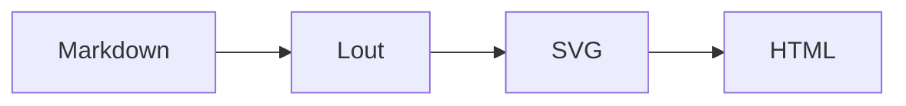

# mdlout tutorial

A getting-started path that takes you from zero to a rendered document
with math, music, diagrams, and live preview. Every command here is
verified against the current working tree. If something fails, you
have hit an environment difference or a regression -- not a typo.

The walkthrough assumes Linux or WSL, Python 3.10 or newer, and a
modern browser. The PDF pipeline additionally needs Ghostscript
(`ps2pdf`); a from-source install of the Lout submodule also needs
`gcc` and `make`. ImageMagick is optional and only used by the
visual-regression tests.

Each section below links to the next, and the closing section points
at [`docs/best_practices.md`](best_practices.md),
[`docs/cookbook.md`](cookbook.md), and the
[`examples/`](../examples/) corpus for deeper material.

---

## 1. Install

Two installation paths -- pick whichever fits.

**From PyPI** (recommended once 0.2.3 is published):

```bash
pip install mdlout
mdlout --help
```

The wheel bundles the Lout binary, the SVG back-end (`z53.c`), and
all standard library files; no `make` step is needed. For PDF
output, also install Ghostscript (`apt install ghostscript` on
Debian / Ubuntu).

**From source** (if 0.2.3 is not on PyPI yet, or to hack on the
converter / Lout back-end):

```bash
git clone https://github.com/jclements3/mdlout.git
cd mdlout
git submodule update --init             # populates lout/
cd lout
git checkout svg-backend                # the SVG back-end branch
make lout                               # builds ./lout/lout (~20 s)
cd ..
./mdlout.py --help
```

Prerequisites for the source build:

- **gcc** + **make** -- the Lout sources are ANSI C; `tcc` also works.
- **Ghostscript** (`ps2pdf`) -- only for `--format=pdf`.
- **ImageMagick** + **poppler** (`pdftoppm`) -- optional, used by
  `tests/run_all.sh` and `examples/generate_gallery.py`.

`mdlout.py` auto-discovers `lout/lout` at that path; no install
step is needed for development. Continue to
[Section 2 -- Hello world](#2-hello-world).

---

## 2. Hello world

Drop a one-line Markdown file in the cwd and render it:

```bash
cat > hello.md << 'EOF'
# Hello, mdlout

If you see this paragraph in your browser, the Markdown -> Lout ->
SVG -> HTML pipeline is working.
EOF
./mdlout.py hello.md
```

`mdlout.py` prints the inlined-asset list and the output filename to
stderr. The result is `hello.html` in your current directory --
open it with `xdg-open hello.html`, `firefox hello.html`, or by
double-clicking it in a file manager.

A slightly fancier hello sample ships in
[`examples/01_hello.md`](../examples/01_hello.md), with pre-built
renders at [`examples/out/01_hello.html`](../examples/out/01_hello.html)
and [`examples/out/01_hello.pdf`](../examples/out/01_hello.pdf).

Two naming notes:

- `./mdlout.py hello.md` writes to `hello.html` in **your cwd** --
  not next to the input file. Use `-o` to override:

  ```bash
  ./mdlout.py /tmp/notes/hello.md -o /tmp/notes/hello.html
  ```

- Lout caches a per-document index in `lout.li` and `lout.lix` in
  cwd. They are safe to delete; mdlout recreates them on the next
  build.

Now that the smoke test passes, [Section 3](#3-output-formats) walks
through the four output modes the same `hello.md` supports.

---

## 3. Output formats

The same Markdown source can produce four different artefacts. Pick
the flag for what you need:

```bash
./mdlout.py hello.md                    # hello.html (default)
./mdlout.py hello.md --format=pdf       # hello.pdf  (PostScript pipeline)
./mdlout.py hello.md --ps               # hello.ps   (stop before ps2pdf)
./mdlout.py hello.md --lout-only        # raw Lout to stdout
./mdlout.py hello.md --lout-only -o hello.lt   # ...or to a file
```

What each one runs and where it lands:

| Flag | Pipeline | Output file | When to use |
|------|----------|-------------|-------------|
| (default) | md -> .lt -> .svg via `lout -G` -> .html scaffold | `<stem>.html` in cwd | Web delivery, math, music, live preview |
| `--format=pdf` | md -> .lt -> .ps via `lout` -> .pdf via `ps2pdf` | `<stem>.pdf` in cwd | Print-ready / archival output |
| `--ps` | md -> .lt -> .ps via `lout` | `<stem>.ps` in cwd | Debug the PostScript step in isolation |
| `--lout-only` | md -> .lt | stdout (or `-o`) | Inspect / hand-edit the intermediate |

The default HTML output is a self-contained file -- KaTeX,
abcjsharp, mermaid.js (when needed), highlight.js, and URW++
Nimbus web fonts are all inlined. No sibling assets, no network at
view time. PDF goes through the frozen PostScript back-end
(`z49.c`) plus Ghostscript and is the canonical render for
paginated layouts. `--ps` stops at PostScript (useful when
Ghostscript is the failure mode); `--lout-only` is the debugging
flag for inspecting the intermediate (see
[`docs/best_practices.md` section 9](best_practices.md#9-debugging-unrendered-content)).

Frontmatter (next) controls the document's geometry and type
across all four output modes.

---

## 4. Frontmatter basics

A YAML block at the top of the file controls document type, page
geometry, font, columns, headers, and table-of-contents generation.
With frontmatter present, mdlout emits a custom Lout setup instead
of the bare `@SysInclude { doc }`.

```markdown
---
type: report
title: My First Report
author: Your Name
date: 2026-05-23
page: A4
orientation: Portrait
columns: 2
font: Times Base 11p
contents: Yes
section-numbers: Arabic
---

# Introduction

Body text. Because `type: report`, the `#` heading above becomes an
`@Section` with automatic numbering, and `contents: Yes` generates
a table of contents.
```

The four `type:` values change how headings map to Lout constructs:

| `type:` | `#` heading | Generates | Typical use |
|---------|-------------|-----------|-------------|
| `doc` (default) | Styled `@Display` block, no auto-numbering | Single-flow document | Letters, CVs, posters, smoke tests |
| `report` | `@Section` (numbered) | Cover, `[TOC]`, sections | Papers, technical notes |
| `book`  | `@Chapter` (Roman by default) | Chapter pages, running heads | Novels, multi-chapter prose |
| `slides` | `@Overhead` slide | One slide per `#` | Presentations |

The keys you reach for most often:

| Key | Example value | Effect |
|-----|---------------|--------|
| `type` | `report` | Document class (see table above) |
| `title` | `My report` | Cover / running header title |
| `author` | `Jane Doe` | Cover author line |
| `date` | `2026-05-23` | Cover date (reports / letters) |
| `page` | `Letter`, `A4`, `A3`, `A5` | Page size |
| `orientation` | `Portrait` / `Landscape` | Page orientation |
| `columns` | `2` | Multi-column body flow |
| `font` | `Times Base 11p` | Body font and size |
| `para-gap` | `1.0v` | Vertical gap between paragraphs |
| `para-indent` | `0f` | First-line indent (0 disables) |
| `page-headers` | `None`, `Simple`, `Titles` | Running header style |
| `contents` | `Yes` | Generate a table of contents |

For type-specific keys (`cover` and `section-numbers` for reports;
`chapter-font`, `chapter-numbers`, and `chapter-start` for books)
see [`docs/best_practices.md` section 2](best_practices.md#2-frontmatter-recipes-for-common-doc-types)
for verified, working templates per document type. The full
key list is documented in the
[top-level README](../README.md).

---

## 5. Math, music, and diagrams

mdlout intercepts four Markdown constructs and routes them through
passthrough macros (`@Math`, `@ABC`, `@Mermaid`, `@SVG`) that the
SVG back-end emits as `<foreignObject>` islands. The HTML scaffold
loads the right client-side engine on demand.

### Math (KaTeX)

LaTeX-style inline and display math:

````markdown
Inline: $\varphi = \tfrac{1 + \sqrt 5}{2}$.

A display equation:

$$
\int_{-\infty}^{\infty} e^{-x^2} \, dx = \sqrt\pi
$$

A fenced display block:

```math
\det\begin{pmatrix} a & b \\ c & d \end{pmatrix} = ad - bc
```
````

KaTeX renders client-side in HTML mode, so the full
[KaTeX feature set](https://katex.org/docs/supported.html) works.
In PDF mode `@Math` is a stub; for paginated math in PDF use raw
`@Eq` inside a ` ```lout ` fence (cookbook recipe 7).

### Music (abcjsharp)

ABC notation in a ` ```abc ` fence:

````markdown
```abc
X:1
T:Frere Jacques
M:4/4
L:1/4
K:G
G A B G | G A B G | B c d2 | B c d2 |
```
````

Routes through `@ABC` and is engraved client-side by abcjsharp
(loaded from `~/projects/abcjsharp/dist/` if present, otherwise
CDN). The maintainer's fork adds a harp grand-staff feature
exercised in [`examples/05_music.md`](../examples/05_music.md).

### Diagrams (Mermaid)

` ```mermaid ` fenced blocks route through `@Mermaid` and render
client-side by Mermaid.js in HTML mode:

````markdown

````

Mermaid.js is ~2 MB and only inlined when at least one
` ```mermaid ` fence is present (`--no-mermaid-engine` skips it
either way). PDF mode renders the source as a placeholder.

For boxes-and-arrows that need to look right in PDF, use Lout's
native `@Diag` package inside a ` ```lout ` fence -- see
[`examples/diag_gallery.md`](../examples/diag_gallery.md).

### Raw SVG

` ```svg ` fenced blocks pass through verbatim:

````markdown
```svg
<circle cx="50" cy="50" r="40" fill="orange" />
```
````

`` images route through `@SVGFile` and inline as
`<image>` elements in HTML; PDF rasterises via `rsvg-convert` when
available. For hand-authoring gotchas (HTML escaping,
Lout-special characters, newline encoding) see
[`docs/best_practices.md` section 5](best_practices.md#5-embedding-diagrams).

---

## 6. Live preview

mdlout has two stdlib-only preview modes for the edit loop -- no
extra dependencies, no IDE plugin needed.

`--watch` polls the input file's mtime every 500 ms and rebuilds on
every save:

```bash
./mdlout.py report.md --watch
```

Each rebuild logs a `[rebuilt HH:MM:SS] report.html` line on
stderr; transient errors are caught and the loop keeps going.
Ctrl-C exits.

`--serve [PORT]` is `--watch` plus a `ThreadingHTTPServer` on
`127.0.0.1`, with Server-Sent Events live reload:

```bash
./mdlout.py report.md --serve          # http://127.0.0.1:8080/
./mdlout.py report.md --serve 9000     # custom port
```

A `<script>` injected before `</body>` opens an
`EventSource("/events")`; every rebuild fires a `reload` event and
the browser refreshes automatically -- save the Markdown, watch
the page catch up. Only `--format=html` is supported; `--serve`
forces HTML even if `--format=pdf` is also passed.

The next section indexes the worked-example corpus.

---

## 7. Examples to learn from

[`examples/`](../examples/) contains worked Markdown documents,
each exercising one corner of the feature set. Every file builds
in both `--format=html` and `--format=pdf`; pre-built renders live
at [`examples/out/`](../examples/out/), and the visual gallery is
at [`examples/out/index.html`](../examples/out/index.html). The
numbered `01_`-`08_` files double as regression fixtures.

**Getting started**

- [`01_hello.md`](../examples/01_hello.md) -- one paragraph; the smallest end-to-end smoke test.

**Typography and text**

- [`02_typography.md`](../examples/02_typography.md) -- bold, italic, code, strikethrough, superscript, nesting.
- [`letter.md`](../examples/letter.md) -- US business letter via `type: doc` plus raw-Lout sender/date/signature blocks.
- [`cv.md`](../examples/cv.md) -- two-column CV with raw-Lout banner and `@TaggedList` skills.
- [`exam.md`](../examples/exam.md) -- calculus midterm with blank workspaces and a separate answer key page.
- [`marginalia.md`](../examples/marginalia.md) -- Tufte-style side-notes via `@RightNote` / `@OuterNote`.
- [`multilingual.md`](../examples/multilingual.md) -- accented Latin, Greek alphabet, Russian via `@Language`.

**Lists and tables**

- [`03_lists_and_tables.md`](../examples/03_lists_and_tables.md) -- bullet / numbered / task / definition lists; pipe and grid tables.

**Math and music**

- [`04_math.md`](../examples/04_math.md) -- `$$...$$` and ` ```math ` blocks, inline `$...$`, matrices, aligned equations.
- [`05_music.md`](../examples/05_music.md) -- three ` ```abc ` blocks including a harp grand-staff.
- [`math_with_diagrams.md`](../examples/math_with_diagrams.md) -- math interleaved with `@Diag` figures.

**Structured documents**

- [`06_report.md`](../examples/06_report.md) -- `type: report` with cover, `[TOC]`, nested sections, code, footnotes.
- [`scientific_paper.md`](../examples/scientific_paper.md) -- workshop-style paper with full IMRaD layout and references.
- [`book_chapter.md`](../examples/book_chapter.md) -- A5 novel chapter with Roman numerals and a pull-quote.
- [`book_with_epigraphs.md`](../examples/book_with_epigraphs.md) -- multi-chapter book with per-chapter epigraphs.
- [`textbook.md`](../examples/textbook.md) -- textbook with worked examples and exercise sets.
- [`technical_manual.md`](../examples/technical_manual.md) -- the mdlout manual itself; the largest example (~25 pages).

**Slides and presentations**

- [`slides_basic.md`](../examples/slides_basic.md) -- six-slide intro using `type: slides`; documents `slidesf` workarounds.
- [`presentation.md`](../examples/presentation.md) -- longer-form presentation with code-as-prose and figure slides.

**Posters, magazines, music charts**

- [`academic_poster.md`](../examples/academic_poster.md) -- A3 landscape, three columns, display title strip.
- [`magazine_layout.md`](../examples/magazine_layout.md) -- US Letter two-column with masthead and pull-quotes.
- [`chord_chart.md`](../examples/chord_chart.md) -- lead-sheet layout combining ABC music and chord diagrams.

**Diagrams (raw Lout)**

- [`diag_gallery.md`](../examples/diag_gallery.md) -- every `@Diag` arrowstyle, every shape, `@Tree`.
- [`complex_diag.md`](../examples/complex_diag.md) -- railroad diagrams, binary search tree, multi-arrow flowcharts.
- [`mermaid.md`](../examples/mermaid.md) -- Mermaid.js routing through ` ```mermaid ` fences.
- [`svg_diagram.md`](../examples/svg_diagram.md) -- ` ```svg ` passthrough and `` inclusion.

**Raw passthrough and kitchen sink**

- [`07_raw_lout_and_svg.md`](../examples/07_raw_lout_and_svg.md) -- ` ```lout ` and ` ```svg ` raw fences with hand-rolled `@Eq`.
- [`08_kitchen_sink.md`](../examples/08_kitchen_sink.md) -- two-column `type: report` exercising every feature in one file.

---

## 8. Where to look next

The tutorial is the on-ramp; the resources below are the
encyclopaedia.

- [`docs/best_practices.md`](best_practices.md) -- idiom guide:
  HTML vs PDF selection, verified frontmatter recipes per doc
  type, citations, figure numbering, syntax highlighting,
  debugging, performance flags.
- [`docs/cookbook.md`](cookbook.md) -- 30+ task-oriented recipes,
  each with motivation, source skeleton, rendered example, and
  the non-obvious gotcha. Cross-references the examples corpus.
- [`docs/z53_internals.md`](z53_internals.md) -- how the SVG
  back-end (`lout/z53.c`) is structured: `BACK_END` interface,
  graphics-state stack, text emission, passthrough-macro routing.
  Read before patching `z53.c`.
- [`examples/CONTRIBUTING.md`](../examples/CONTRIBUTING.md) --
  how to add a new file to the example corpus: topic selection,
  frontmatter conventions, both-pipelines-must-build rule,
  gallery regeneration, PR conventions.
- [`examples/PUBLISHING.md`](../examples/PUBLISHING.md) -- getting
  mdlout HTML onto a public URL via GitHub Pages, Netlify,
  Cloudflare Pages, S3, or sftp.
- [`examples/out/index.html`](../examples/out/index.html) -- the
  visual gallery: every example as a card with a page-1
  thumbnail and links to HTML, PDF, source, and preview.
- [`README.md`](../README.md) -- top-level CLI reference, full
  frontmatter key table, project layout.
- [`TODO.md`](../TODO.md) -- current roadmap, known gaps in
  `@Diag` / `@Eq` / slides. Check before opening an issue.
- [`tests/README.md`](../tests/README.md) -- regression-suite
  layout. `bash tests/run_all.sh` walks 49+ snippets in 30 seconds.
