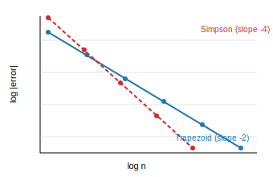

```lout
@CentredDisplay @Font { +24p } @B {
Convergence of Newton-Cotes Quadrature
}
@CentredDisplay @Font { +12p } @I {
J. L. Clements -- mdlout project, Sydney -- james.l.clements.iii "@" gmail.com
}
@DP
```

## Abstract

We revisit the composite trapezoidal and Simpson 1/3 rules and chart
their behaviour on four representative integrals, two smooth and two
with endpoint singularities. On smooth integrands we recover the
textbook $O(h^2)$ and $O(h^4)$ rates; on singular integrands both
rules degrade together, and the high-order advantage of Simpson's
rule collapses to a small constant factor. The poster summarises the
results in three columns: introduction, method, and numerical
evidence.

## Introduction

Numerical integration is the inner loop of most scientific computing.
Closed-form antiderivatives are the exception; the rule is to discretise
the integration interval and sum weighted samples of the integrand.
The two simplest composite rules date to Newton and Simpson and remain
in routine use as the inner kernels of adaptive quadrature libraries
[@piessens1983]. Despite their age, the quantitative comparison of the
two rules on specific integrand classes continues to inform practical
algorithm choices [@davis1984].

The fundamental question -- *how many samples are needed, and where
should they be placed?* -- has been studied since Newton, but it
continues to surface in modern guises whenever a new class of
integrand puts pressure on existing libraries.

## Method

Let $f : [a, b] \to \mathbb{R}$ and partition $[a, b]$ into $n$ equal
subintervals of width $h = (b - a)/n$. The composite trapezoidal rule
approximates the integral by

$$
T_n(f) = \frac{h}{2} \left[ f(x_0) + 2 \sum_{i=1}^{n-1} f(x_i) + f(x_n) \right]
$$

with leading error $-(b-a)h^2 f''(\xi)/12$ for $\xi \in (a, b)$,
provided $f \in C^2[a,b]$. The rule is second-order accurate.

With $n$ even, Simpson's 1/3 rule groups nodes in overlapping triples
and integrates the quadratic interpolant exactly:

$$
S_n(f) = \frac{h}{3} \left[ f(x_0) + 4 \sum_{k=1}^{n/2} f(x_{2k-1}) + 2 \sum_{k=1}^{n/2-1} f(x_{2k}) + f(x_n) \right]
$$

with leading error $-(b-a)h^4 f^{(4)}(\eta)/180$ for $\eta \in (a, b)$.
The rule is fourth-order accurate. Both rules were implemented in
double precision IEEE 754 with Kahan-compensated summation [@kahan1965].

## Results

Table @tab:errors collects absolute errors for $I_1 = \int_0^1 e^x \, dx$
as $n$ doubles. The ratio column confirms the asymptotic prediction:
trapezoidal errors fall by $4\times$ per halving of $h$, Simpson's by
$16\times$.

|  n  | $\lvert T_n - I_1\rvert$ | ratio | $\lvert S_n - I_1\rvert$ | ratio |
|----:|:-------------------------|:-----:|:-------------------------|:-----:|
| 8   | $2.24\!\times\!10^{-3}$  | ---   | $3.65\!\times\!10^{-7}$  | ---   |
| 16  | $5.59\!\times\!10^{-4}$  | 4.00  | $2.28\!\times\!10^{-8}$  | 16.00 |
| 32  | $1.40\!\times\!10^{-4}$  | 4.00  | $1.42\!\times\!10^{-9}$  | 16.00 |
| 64  | $3.49\!\times\!10^{-5}$  | 4.00  | $8.91\!\times\!10^{-11}$ | 16.00 |
[#tab:errors]

The convergence is plotted in figure @fig:result, a log-log diagram of
absolute error against $n$ for both rules. The slopes are $-2.00$ and
$-4.00$ respectively, exactly the Euler-Maclaurin prediction.

{#fig:result}

For integrands with endpoint singularities the picture changes. Both
rules degrade to sub-quadratic convergence, and the constant-factor
advantage of Simpson's rule shrinks to roughly $1/3$ across the range
of $n$ we sampled. A graded mesh or a substitution $u = \sqrt{x}$
recovers the smooth-case rates [@lyness1967].

## Discussion

Three textbook observations and one subtler one fall out. First, on
smooth integrands Simpson's rule should be the default: the
implementation cost is essentially identical to the trapezoidal rule
and the asymptotic advantage is dramatic. Second, the asymptotic
theory is fragile -- once smoothness is lost at an endpoint, both rules
degrade together. Third, adaptive routines interleave the two rules
not for accuracy but for *error estimation*, exploiting Richardson
extrapolation on the Simpson-minus-trapezoidal difference.

The subtler observation is that the Simpson-to-trapezoidal error
ratio tends to a function of the integrand's regularity, not of $h$.
Students who memorise $h^4 \ll h^2$ are often surprised when, on a
real singular integrand, the two rules agree to within a factor of
three.

## References

[@davis1984]: P. J. Davis and P. Rabinowitz. *Methods of Numerical Integration.* Second edition. Academic Press, Orlando, 1984.

[@piessens1983]: R. Piessens et al. *QUADPACK: A Subroutine Package for Automatic Integration.* Springer-Verlag, Berlin, 1983.

[@lyness1967]: J. N. Lyness and B. W. Ninham. Numerical quadrature and asymptotic expansions. *Mathematics of Computation*, 21(98):162-178, 1967.

[@kahan1965]: W. Kahan. Pracniques: further remarks on reducing truncation errors. *Communications of the ACM*, 8(1):40, 1965.

[@kingston1993]: J. H. Kingston. The design and implementation of the Lout document formatting language. *Software --- Practice and Experience*, 23(9):1001-1041, 1993.
