# mdlout example gallery

**mdlout** converts Markdown into typeset documents by routing through
[Lout](https://github.com/william8000/lout), a small ANSI-C document
formatter. The default output is HTML wrapped around a Lout-emitted SVG;
the `--format=pdf` flag selects the legacy PostScript path. This gallery
indexes every worked example committed to `examples/`. Each entry shows a
page-1 thumbnail and links out to the rendered HTML, the rendered PDF,
and the Markdown source. This page itself was built by mdlout from
[`gallery.md`](gallery.md).

## Getting started

### Hello

The smallest possible end-to-end smoke test: one paragraph of prose.
1 page.


[HTML](out/01_hello.html) | [PDF](out/01_hello.pdf) | [Markdown source](01_hello.md)

### Typography sampler

Inline spans: bold, italic, bold-italic, inline code, strikethrough,
superscript, and backslash escapes. HTML mode only at present.
1 page.

[HTML](out/02_typography.html) | [Markdown source](02_typography.md)

### Lists and tables

Bullet, numbered, task, and definition lists; pipe tables with alignment
markers; grid tables. 2 pages.

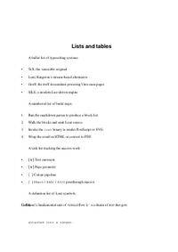

[HTML](out/03_lists_and_tables.html) | [PDF](out/03_lists_and_tables.pdf) | [Markdown source](03_lists_and_tables.md)

## Math and music

### Block and inline math

`$$..$$` and ` ```math ` fenced display math, plus inline `$..$`:
integrals, sums, fractions, matrices, and aligned equations.
1 page.

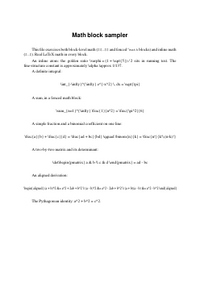

[HTML](out/04_math.html) | [PDF](out/04_math.pdf) | [Markdown source](04_math.md)

### Music notation

Three ` ```abc ` fenced blocks of increasing complexity, including a
`%%score`-locked harp grand-staff. Routed through `@ABC` and abcjsharp
in HTML mode. 1 page.

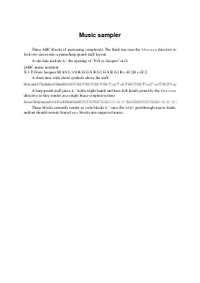

[HTML](out/05_music.html) | [PDF](out/05_music.pdf) | [Markdown source](05_music.md)

### Chord chart with multi-voice scores

A heavier ABC workload than the introductory music example: multi-line
scores, multiple voices, and dense chord-symbol annotations above each
bar. 2 pages.

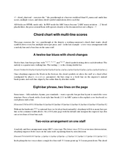

[HTML](out/chord_chart.html) | [PDF](out/chord_chart.pdf) | [Markdown source](chord_chart.md)

### Math proofs with sequence diagrams

Short mathematical derivations paired with mermaid sequence diagrams
that narrate each step. KaTeX and mermaid coexist in the same flow.
2 pages.

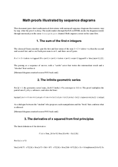

[HTML](out/math_with_diagrams.html) | [PDF](out/math_with_diagrams.pdf) | [Markdown source](math_with_diagrams.md)

## Diagrams

### Diag gallery

Exhaustive `@Diag` exercise: every arrowstyle, shape macro, and
`@Tree`. Raw-Lout fences throughout. The canonical reference for what
the SVG back-end handles. 7 pages.

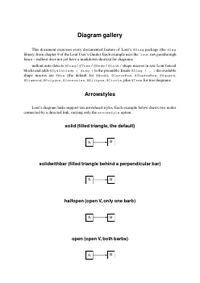

[HTML](out/diag_gallery.html) | [PDF](out/diag_gallery.pdf) | [Markdown source](diag_gallery.md)

### Complex diagrams

A demanding follow-up: arithmetic-expression grammars as railroad
diagrams, binary search trees, paint-filled subsystem boxes, multi-style
flowcharts, and composite figures. 4 pages.

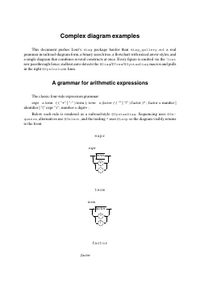

[HTML](out/complex_diag.html) | [PDF](out/complex_diag.pdf) | [Markdown source](complex_diag.md)

### Mermaid diagrams

The `@Mermaid` passthrough routes ` ```mermaid ` fences through a
`foreignObject` for browser-side rendering. Three common shapes; PDF
falls back to placeholders. 1 page.

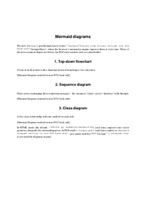

[HTML](out/mermaid.html) | [PDF](out/mermaid.pdf) | [Markdown source](mermaid.md)

### Hand-rolled SVG

The ` ```svg ` fenced-code passthrough routed through `@SVG`. Inlines
verbatim in HTML mode; falls back to a stub in PDF mode. 2 pages.

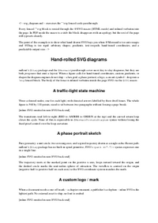

[HTML](out/svg_diagram.html) | [PDF](out/svg_diagram.pdf) | [Markdown source](svg_diagram.md)

## Structured documents

### Pipeline status report

`type: report` with cover, `[TOC]`, `@Section` nesting, code fences,
math, footnotes, and a raw-Lout figure. The minimum a multi-section
paper needs. 3 pages.


[HTML](out/06_report.html) | [PDF](out/06_report.pdf) | [Markdown source](06_report.md)

### Scientific paper

Short workshop-style paper on trapezoidal and Simpson's quadrature.
Abstract / introduction / methods / results / discussion / references,
display math, pipe tables of error data, a `@Diag` figure, manual
bibliography. 6 pages.


[HTML](out/scientific_paper.html) | [PDF](out/scientific_paper.pdf) | [Markdown source](scientific_paper.md)

### Technical manual

The mdlout technical manual itself, the largest example in the corpus.
Exercises every report-level idiom: cover, abstract, multi-page TOC,
deeply nested sections, footnotes, citations, code, and inline math.
25 pages.

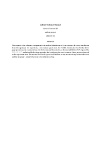

[HTML](out/technical_manual.html) | [PDF](out/technical_manual.pdf) | [Markdown source](technical_manual.md)

### Kitchen sink

Two-column `type: report` combining headings, lists, tables, math,
music, code, raw Lout, and the full inline-formatting menagerie into
one file. The canonical end-to-end regression target. 3 pages.


[HTML](out/08_kitchen_sink.html) | [PDF](out/08_kitchen_sink.pdf) | [Markdown source](08_kitchen_sink.md)

### Raw Lout and SVG passthrough

` ```lout ` and ` ```svg ` raw-passthrough fences for testing `@SVG`
routing, plus hand-rolled `@Eq` math and a boxed display block.
1 page.

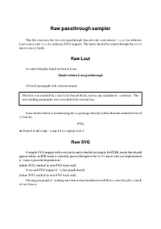

[HTML](out/07_raw_lout_and_svg.html) | [PDF](out/07_raw_lout_and_svg.pdf) | [Markdown source](07_raw_lout_and_svg.md)

## Books and reports

### Book chapter

A5 novel chapter with Roman chapter numerals, subheadings, a raw-Lout
pull-quote, and an `@FootNote` invoked via raw Lout. 3 pages.

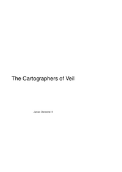

[HTML](out/book_chapter.html) | [PDF](out/book_chapter.pdf) | [Markdown source](book_chapter.md)

### Book with epigraphs

Three short letters with chapter-opening epigraphs. A5 trim, Times
roman, recto-aligned page numbers, `chapter-start: Any`. 3 pages.

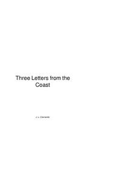

[HTML](out/book_with_epigraphs.html) | [PDF](out/book_with_epigraphs.pdf) | [Markdown source](book_with_epigraphs.md)

### Textbook

An introduction to numerical analysis: A4 textbook trim, multi-chapter
structure, Arabic chapter and section numbering, theorems and worked
examples, math throughout. 10 pages.

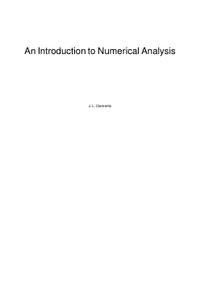

[HTML](out/textbook.html) | [PDF](out/textbook.pdf) | [Markdown source](textbook.md)

### Slides (basic)

`type: slides`, six-slide intro to Lout. Title slide, bullet list,
math-as-prose, code-as-prose, a centred-display pipeline figure.
9 pages.

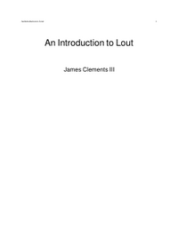

[HTML](out/slides_basic.html) | [PDF](out/slides_basic.pdf) | [Markdown source](slides_basic.md)

### Presentation

`type: slides`, ten-slide deck mixing prose, math, code, and a mermaid
diagram. 11 pages.

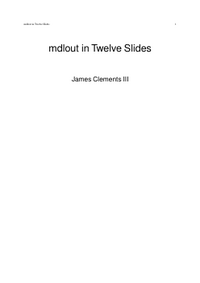

[HTML](out/presentation.html) | [PDF](out/presentation.pdf) | [Markdown source](presentation.md)

## Posters

### Academic poster

A3 landscape, three columns, generous margins, large display heading.
Abstract / introduction / method / results / discussion / references in
a flowing three-column grid. 2 pages.

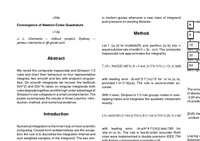

[HTML](out/academic_poster.html) | [PDF](out/academic_poster.pdf) | [Markdown source](academic_poster.md)

### Magazine layout

US Letter, two columns with a 1 cm gutter, raw-Lout masthead and
pull-quotes. The narrative equivalent of the CV's column layout.
3 pages.

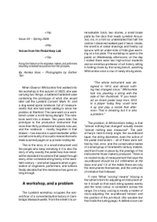

[HTML](out/magazine_layout.html) | [PDF](out/magazine_layout.pdf) | [Markdown source](magazine_layout.md)

## Specialised

### Letter

Formal US business letter built on `type: doc` plus raw-Lout
passthrough for the sender block, date, recipient block, and signature.
The de-facto template for letters until `type: letter` lands.
1 page.

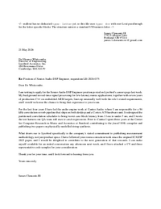

[HTML](out/letter.html) | [PDF](out/letter.pdf) | [Markdown source](letter.md)

### CV

Two-column CV for a fictitious senior audio DSP engineer. Raw-Lout
`@TaggedList` for skills, raw-Lout banner heading, markdown prose for
the bulk. 1 page.

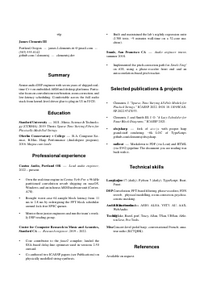

[HTML](out/cv.html) | [PDF](out/cv.pdf) | [Markdown source](cv.md)

### Exam

Five-question calculus midterm with blank workspaces between questions
and a separate answer key page. The template for quizzes, worksheets,
and exam booklets. 3 pages (PDF) / 6 pages (HTML).

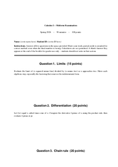

[HTML](out/exam.html) | [PDF](out/exam.pdf) | [Markdown source](exam.md)

### Marginalia

Widened right margin plus raw-Lout `@RightNote` and `@OuterNote` fences
for Tufte-style side-notes. Demonstrates note attachment, automatic
collision shifts, and recto/verso-aware placement. 2 pages.

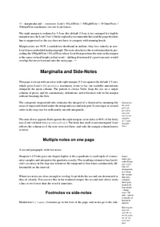

[HTML](out/marginalia.html) | [PDF](out/marginalia.pdf) | [Markdown source](marginalia.md)

### Multilingual

Three character regimes: accented Western-European Latin via `@Char`,
the Greek alphabet plus math operators via the Adobe Symbol font, a
KaTeX math display, and a Russian-language paragraph via `@Language`.
3 pages.

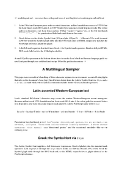

[HTML](out/multilingual.html) | [PDF](out/multilingual.pdf) | [Markdown source](multilingual.md)

## See also

- [examples/README.md](README.md) for a tabular index with deeper
  per-example notes.
- [project README](../README.md) for an overview of the toolchain.
- [TODO.md](../TODO.md) for the current state of the SVG back-end and
  known gaps.
