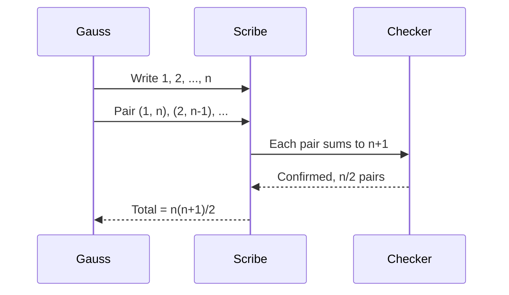
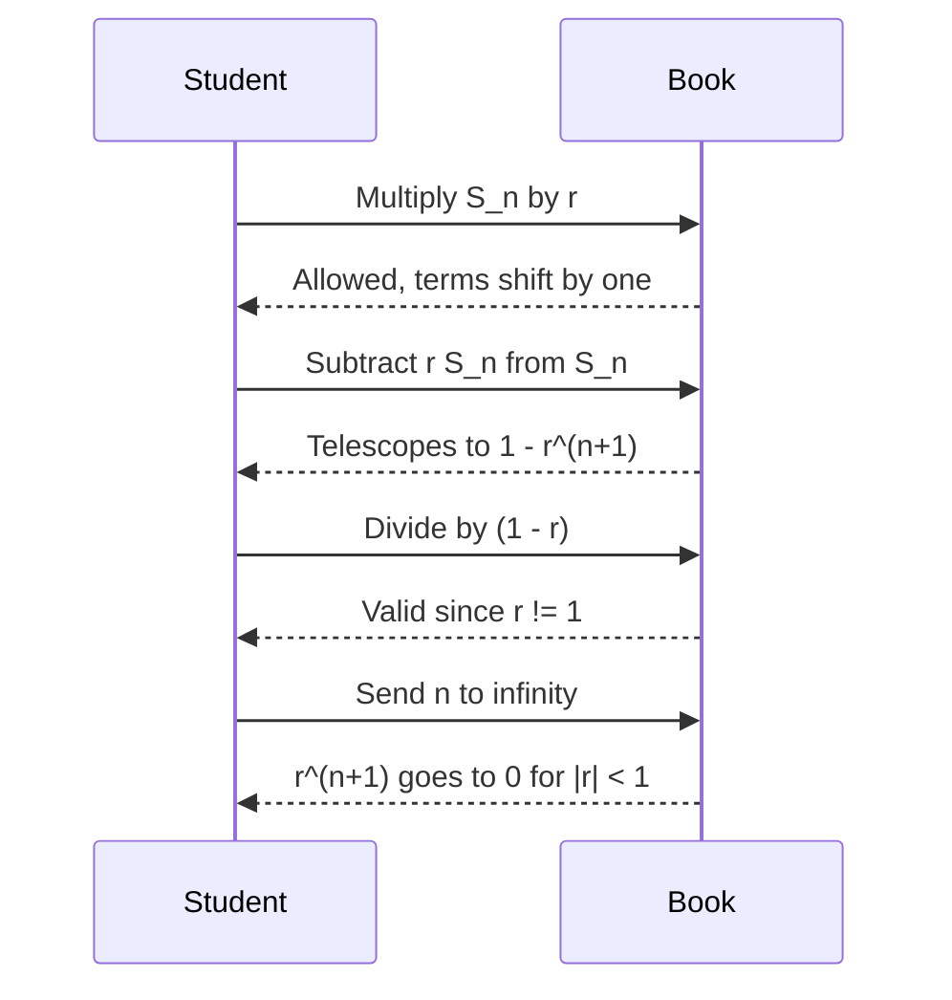
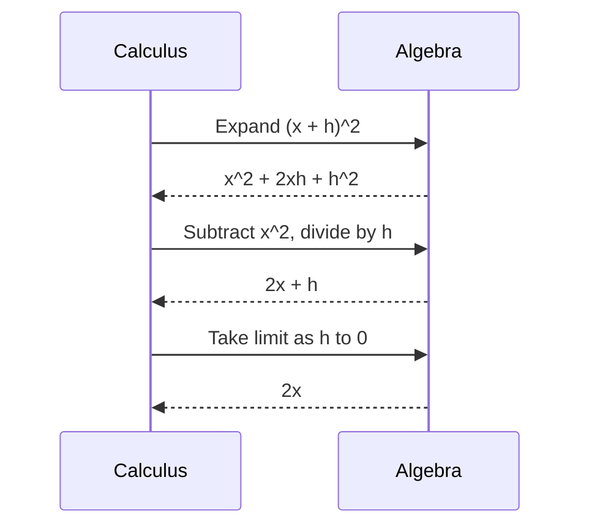
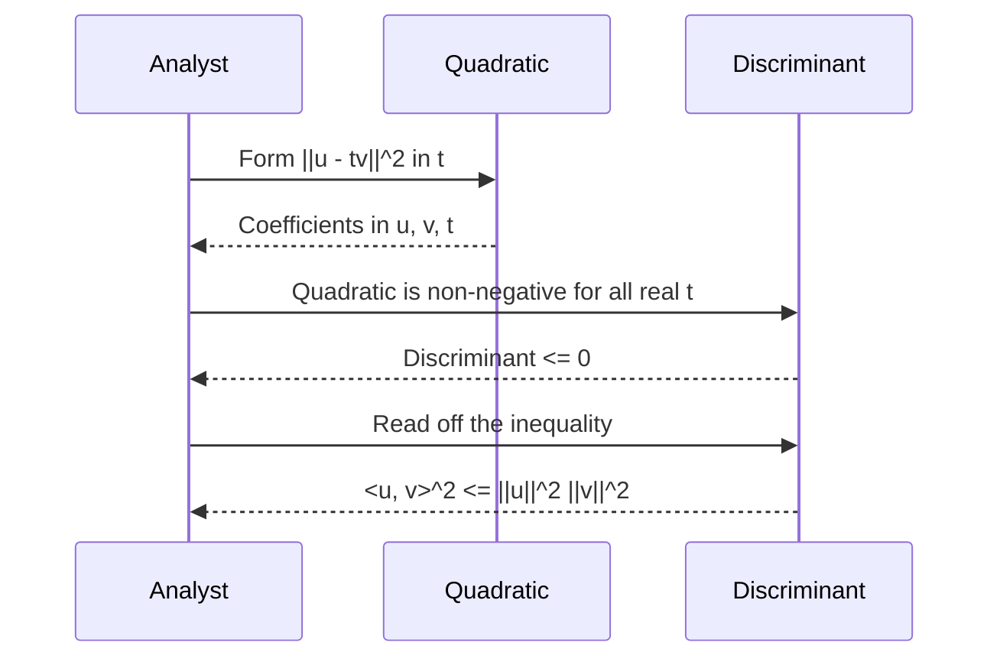

# Math proofs illustrated by sequence diagrams

This document pairs short mathematical derivations with mermaid sequence
diagrams that narrate, step by step, what the proof is *doing*. The math
renders through KaTeX in HTML mode; the diagrams render through mermaid.js
in the same `foreignObject` channel. Both engines coexist in the same flow.

## 1. The sum of the first n integers

The classical Gauss anecdote: pair the first and last terms of the sum
$1 + 2 + \cdots + n$, then the second and second-last, and so on. Each pair
sums to $n+1$, and there are $n/2$ pairs.

$$
S = 1 + 2 + \cdots + n
\qquad
2S = (n+1) + (n+1) + \cdots + (n+1) = n(n+1)
\qquad
S = \frac{n(n+1)}{2}.
$$

The pairing as a sequence of moves, with a "scribe" actor that writes the
intermediate result and a "checker" that verifies it:

## 2. The infinite geometric series

For $|r| < 1$, the geometric series $\sum_{k=0}^{\infty} r^k$ converges to
$1/(1-r)$. The proof multiplies the partial sum $S_n$ by $r$, subtracts,
and takes the limit.

$$
\begin{aligned}
S_n      &= 1 + r + r^2 + \cdots + r^n \\
r S_n    &= \quad\; r + r^2 + \cdots + r^n + r^{n+1} \\
(1-r)S_n &= 1 - r^{n+1} \\
S_n      &= \frac{1 - r^{n+1}}{1 - r}
         \xrightarrow{n \to \infty}
         \frac{1}{1 - r}.
\end{aligned}
$$

As a dialogue between the "student" who proposes each manipulation and the
"book" that confirms what is allowed:

## 3. The derivative of x squared from first principles

The limit definition of the derivative:

$$
f'(x) = \lim_{h \to 0} \frac{f(x+h) - f(x)}{h}.
$$

For $f(x) = x^2$:

$$
\frac{(x+h)^2 - x^2}{h}
= \frac{x^2 + 2xh + h^2 - x^2}{h}
= \frac{2xh + h^2}{h}
= 2x + h
\xrightarrow{h \to 0}
2x.
$$

The same calculation as a back-and-forth between "calculus" and "algebra":

## 4. The Cauchy-Schwarz inequality

For real vectors $\mathbf{u}, \mathbf{v}$, the inequality
$|\langle \mathbf{u}, \mathbf{v} \rangle| \le \|\mathbf{u}\|\,\|\mathbf{v}\|$
follows from the non-negativity of the squared norm
$\|\mathbf{u} - t\mathbf{v}\|^2$ for all real $t$. The discriminant of the
resulting quadratic in $t$ must be non-positive.

$$
\|\mathbf{u} - t\mathbf{v}\|^2
= \|\mathbf{u}\|^2 - 2t\,\langle \mathbf{u}, \mathbf{v} \rangle + t^2 \|\mathbf{v}\|^2
\;\ge\; 0.
$$

Treating this as a quadratic in $t$ with non-positive discriminant:

$$
\bigl(2\,\langle \mathbf{u}, \mathbf{v} \rangle\bigr)^2
- 4\,\|\mathbf{u}\|^2 \|\mathbf{v}\|^2 \le 0
\;\Longrightarrow\;
\langle \mathbf{u}, \mathbf{v} \rangle^2 \le \|\mathbf{u}\|^2 \|\mathbf{v}\|^2.
$$

The proof as a passing-the-baton between three reviewers:

## Section summary

Each of the four proofs exercises a single algebraic move
(pairing, telescoping, the limit definition, a non-negative quadratic) and
each is shadowed by a mermaid sequence diagram in which the move is voiced
by named actors. The HTML build engraves all four diagrams alongside the
KaTeX-rendered math; the PDF build keeps the math via `@Math`'s placeholder
and renders each mermaid block as `[Mermaid diagram omitted in non-SVG
back-end]`. For an archival PDF that includes the diagrams, pre-render each
fence with `mmdc -i diag.mmd -o diag.svg` and inline the result via
``.
