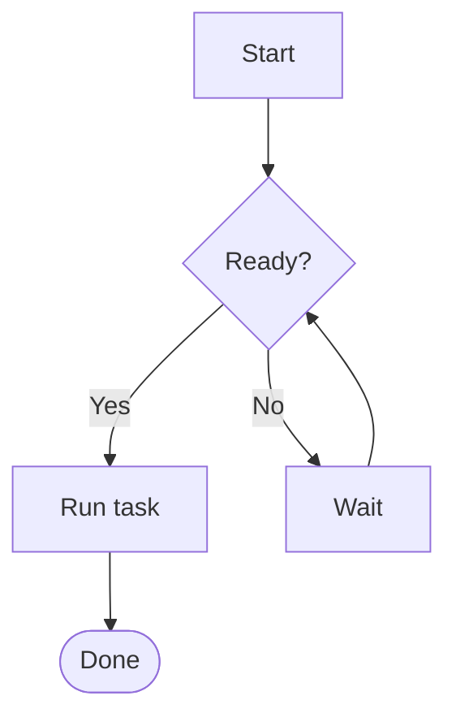
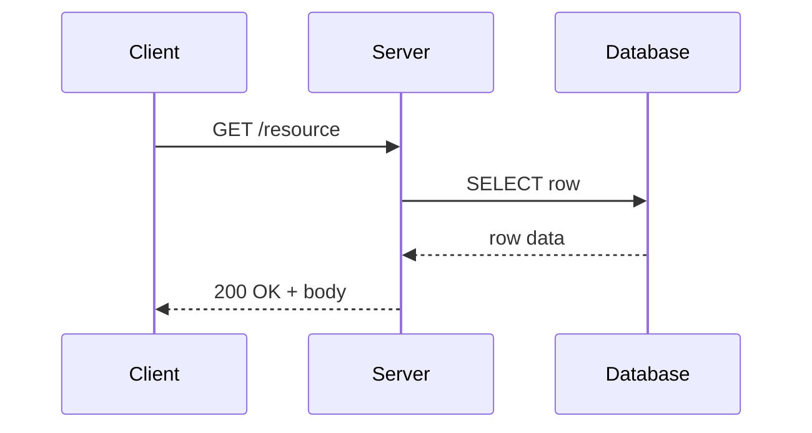
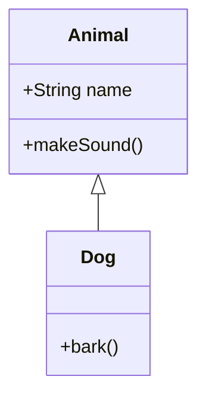

# Mermaid diagrams

The new `@Mermaid` passthrough macro routes ```` ```mermaid ```` fenced
code blocks through the SVG back-end's `foreignObject`, where the
browser's mermaid.js engine engraves them at view-time. Three of the
most common shapes are below; the PDF route renders each as a
placeholder.

## 1. Top-down flowchart

A four-node flowchart with a diamond decision branching to two
outcomes:



## 2. Sequence diagram

Three actors exchanging three round-trip messages -- the canonical
"client / server / database" walk-through:



## 3. Class diagram

A two-class relationship with one method on each side:



In HTML mode (the default `./mdlout.py examples/mermaid.md`), each
fence engraves into vector geometry alongside the surrounding prose.
In PDF mode (`--format=pdf`), each fence renders as `[Mermaid diagram
omitted in non-SVG back-end]` -- pre-render with the `mmdc` CLI and
`` if you need the diagrams in print.
