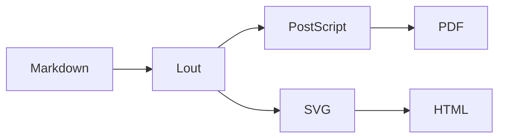

# mdlout in Ten Slides

*A ten-slide tour of the Markdown to Lout pipeline*

James Clements III  ---  May 2026

# Why a Markdown Front End?

- Lout is a beautiful but **obscure** typesetting system
- Markdown is *ubiquitous* but **plain**
- mdlout bridges the two: write Markdown, render through Lout
- Best of both worlds: pandoc-style ergonomics, TeX-class output
- Stdlib-only Python; one script, ~3k lines

# What Builds in `type: slides`?

mdlout turns each `# H1 heading` into an `@Overhead` slide. Inside
each slide:

- **Prose, lists, bold, italic, inline code** --- all fine
- **Pull quotes, raw-Lout `@CentredDisplay`** --- fine
- **Headings H2-H6** --- render as display blocks within the slide
- **Footnotes, tables, `@Diag`, `@Math`** --- *known to be brittle*
  on the `slidesf` flow path in this fork; use display equivalents
  or pre-rendered images instead

# A Three-Bullet Story

The Lout pipeline is conceptually flat:

- **Markdown** parses to a list of `Block` objects
- **Lout** source is emitted with `@SysInclude { slides }`
- **PostScript** or **SVG** falls out the back end

Each stage is independently inspectable. Pass `--lout-only` to
see the intermediate, or `--ps` to stop before the PDF step.

# Math: Pythagoras on a Slide

The canonical right-triangle identity. The `eq` package is not
auto-included by `slidesf`, so we render the equation typographically
as a centred-display string rather than a true `@Eq` formula:

```lout
@CentredDisplay @Font { +6p } @B {
  a^2  +  b^2  =  c^2
}
```

For real `@Eq` math on a slide, add `@SysInclude { eq }` to the
preamble of a raw-Lout `mydefs` file (recipe #9) --- mdlout will
copy it in and the equation typesets. For LaTeX-style markdown
math the only stable route today is `type: doc` with KaTeX.

# A Touch of Code

Lout's `@Verbatim` *cannot* close its own `@End` tag inside an
`@Overhead`, so we can't ship a literal code block on a slide
the way recipe #5 ships one in `type: doc`. Workaround:
*describe* the code, then point at the source file:

- Step 1: `./mdlout.py talk.md`  (HTML default)
- Step 2: `./mdlout.py talk.md --format=pdf`
- Step 3: open `talk.html` or `talk.pdf` in your viewer

Real code listings belong in the speaker's notes or in a
side-by-side `type: report` companion document.

# A Mermaid Diagram

The `@Mermaid` passthrough macro routes ` ```mermaid ` fenced
blocks through `<foreignObject>` for browser-side rendering. On
the `slidesf` flow path the foreignObject can collide with the
overhead frame's clipping, so we fall back to a centred prose
sketch and link to a separate `--format=html` document for the
live diagram.



# Pull-Quote Slide

Pull quotes work on slides exactly as they do in
`type: doc`. Raw-Lout `@CentredDisplay @I { ... }`:

```lout
@CentredDisplay @I {
"A document language should be a language, not a dialect of pain."
}
@CentredDisplay { --- the mdlout style guide }
```

# Live Preview

For talks-in-progress, run `./mdlout.py talk.md --serve` and
point a browser at `http://127.0.0.1:8080/`. Every save to the
`.md` triggers a rebuild and a browser reload via SSE.

- `--watch` --- rebuild on save, no server
- `--serve [PORT]` --- watch plus live-reload server on PORT (8080 by default)
- HTML only; ask for `--format=pdf` and the server overrides to HTML

# Thanks

- mdlout: <https://github.com/jclements3/mdlout>
- Lout (upstream, William Chia-Wei Cheng's william8000 fork)
- This fork's `z53.c` SVG back-end: see `lout/SVG_PORTING.md`
- Patches and bug reports welcome on GitHub

*Questions?*
