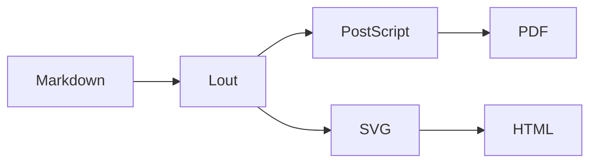

# mdlout in Twelve Slides

*A short tour of the Markdown to Lout pipeline*

James Clements III  ---  May 2026

# Why a Markdown Front End?

- Lout is a beautiful but **obscure** typesetting system
- Markdown is *ubiquitous* but **plain**
- mdlout bridges the two: write Markdown, render through Lout
- Best of both worlds: pandoc-style ergonomics, TeX-class output
- Stdlib-only Python; one script, ~3k lines

# What Builds in `type: slides`?

mdlout turns each `# H1 heading` into an `@Overhead` slide. Inside
each slide:

- **Prose, lists, bold, italic, inline code** --- all fine
- **Pull quotes, raw-Lout `@CentredDisplay`** --- fine
- **Headings H2-H6** --- render as display blocks within the slide
- **Footnotes, tables, `@Diag`, `@Math`** --- *known to be brittle*
  on the `slidesf` flow path in this fork; use display equivalents
  or pre-rendered images instead

# Part I --- The Pipeline

```lout
@CentredDisplay @Font { +18p } @B { Part I }
@CentredDisplay @Font { +12p } @I {
"The Pipeline"
}
@CentredDisplay { ~ }
@CentredDisplay @I {
"Markdown in, PostScript or SVG out, three stages between."
}
```

# A Three-Bullet Story

The Lout pipeline is conceptually flat:

- **Markdown** parses to a list of `Block` objects
- **Lout** source is emitted with `@SysInclude { slides }`
- **PostScript** or **SVG** falls out the back end

Each stage is independently inspectable. Pass `--lout-only` to
see the intermediate, or `--ps` to stop before the PDF step.

# Pipeline at a Glance

A hand-drawn SVG diagram of the same flow, rendered inline by the
`@SVG` passthrough macro --- the browser draws this directly, no
external image required:

```svg
<svg xmlns="http://www.w3.org/2000/svg" viewBox="0 0 360 80" width="360" height="80">
  <defs>
    <marker id="ar" viewBox="0 0 10 10" refX="9" refY="5"
            markerWidth="6" markerHeight="6" orient="auto-start-reverse">
      <path d="M0,0 L10,5 L0,10 z" fill="#444"/>
    </marker>
  </defs>
  <g font-family="Helvetica, sans-serif" font-size="11" fill="#222">
    <rect x="6"   y="22" width="70" height="36" rx="6" fill="#eef" stroke="#557"/>
    <text x="41"  y="44" text-anchor="middle">Markdown</text>
    <rect x="106" y="22" width="60" height="36" rx="6" fill="#efe" stroke="#575"/>
    <text x="136" y="44" text-anchor="middle">Lout</text>
    <rect x="196" y="2"  width="70" height="36" rx="6" fill="#fee" stroke="#755"/>
    <text x="231" y="24" text-anchor="middle">PostScript</text>
    <rect x="196" y="42" width="70" height="36" rx="6" fill="#fef" stroke="#757"/>
    <text x="231" y="64" text-anchor="middle">SVG</text>
    <rect x="290" y="22" width="60" height="36" rx="6" fill="#ffe" stroke="#775"/>
    <text x="320" y="40" text-anchor="middle">PDF /</text>
    <text x="320" y="54" text-anchor="middle">HTML</text>
    <line x1="76"  y1="40" x2="106" y2="40" stroke="#444" marker-end="url(#ar)"/>
    <line x1="166" y1="36" x2="196" y2="22" stroke="#444" marker-end="url(#ar)"/>
    <line x1="166" y1="44" x2="196" y2="58" stroke="#444" marker-end="url(#ar)"/>
    <line x1="266" y1="22" x2="290" y2="36" stroke="#444" marker-end="url(#ar)"/>
    <line x1="266" y1="58" x2="290" y2="44" stroke="#444" marker-end="url(#ar)"/>
  </g>
</svg>
```

# Math: Pythagoras on a Slide

The canonical right-triangle identity. The `eq` package is not
auto-included by `slidesf`, so we render the equation typographically
as a centred-display string rather than a true `@Eq` formula:

```lout
@CentredDisplay @Font { +6p } @B {
  a^2  +  b^2  =  c^2
}
```

For real `@Eq` math on a slide, add `@SysInclude { eq }` to the
preamble of a raw-Lout `mydefs` file (recipe #9) --- mdlout will
copy it in and the equation typesets. For LaTeX-style markdown
math the only stable route today is `type: doc` with KaTeX.

# Part II --- Authoring

```lout
@CentredDisplay @Font { +18p } @B { Part II }
@CentredDisplay @Font { +12p } @I {
"Authoring"
}
@CentredDisplay { ~ }
@CentredDisplay @I {
"Code, diagrams, quotes, live preview."
}
```

# A Touch of Code

Lout's `@Verbatim` *cannot* close its own `@End` tag inside an
`@Overhead`, so we can't ship a literal code block on a slide
the way recipe #5 ships one in `type: doc`. Workaround:
*describe* the steps as a numbered list, then point at the source
file:

1. `./mdlout.py talk.md`  (HTML default)
2. `./mdlout.py talk.md --format=pdf`
3. Open `talk.html` or `talk.pdf` in your viewer
4. Iterate with `--serve` for live reload

Real code listings belong in the speaker's notes or in a
side-by-side `type: report` companion document.

# A Mermaid Diagram

The `@Mermaid` passthrough macro routes ` ```mermaid ` fenced
blocks through `<foreignObject>` for browser-side rendering. On
the `slidesf` flow path the foreignObject can collide with the
overhead frame's clipping, so we fall back to a centred prose
sketch and link to a separate `--format=html` document for the
live diagram.



# Pull-Quote Slide

Pull quotes work on slides exactly as they do in
`type: doc`. Raw-Lout `@CentredDisplay @I { ... }`:

```lout
@CentredDisplay @I {
"A document language should be a language, not a dialect of pain."
}
@CentredDisplay { --- the mdlout style guide }
```

# Live Preview

For talks-in-progress, run `./mdlout.py talk.md --serve` and
point a browser at `http://127.0.0.1:8080/`. Every save to the
`.md` triggers a rebuild and a browser reload via SSE.

- `--watch` --- rebuild on save, no server
- `--serve [PORT]` --- watch plus live-reload server on PORT (8080 by default)
- HTML only; ask for `--format=pdf` and the server overrides to HTML

# Thank You --- Questions?

```lout
@CentredDisplay @Font { +20p } @B {
"Thank you."
}
@CentredDisplay { ~ }
@CentredDisplay @Font { +10p } @I {
"Questions?"
}
```

- mdlout: <https://github.com/jclements3/mdlout>
- Lout (upstream, William Chia-Wei Cheng's william8000 fork)
- This fork's `z53.c` SVG back-end: see `lout/SVG_PORTING.md`
- Patches and bug reports welcome on GitHub
